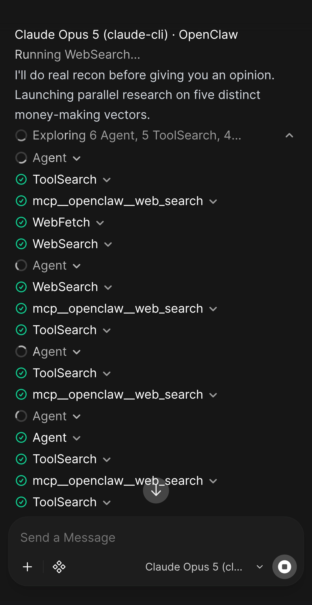
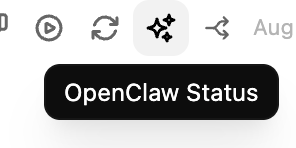
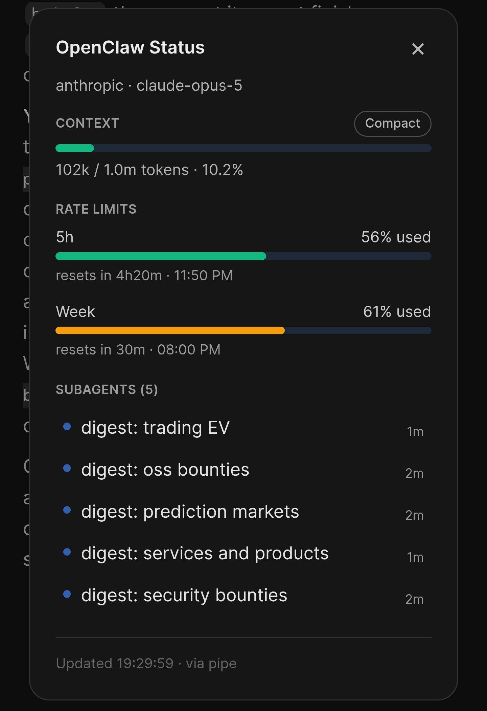
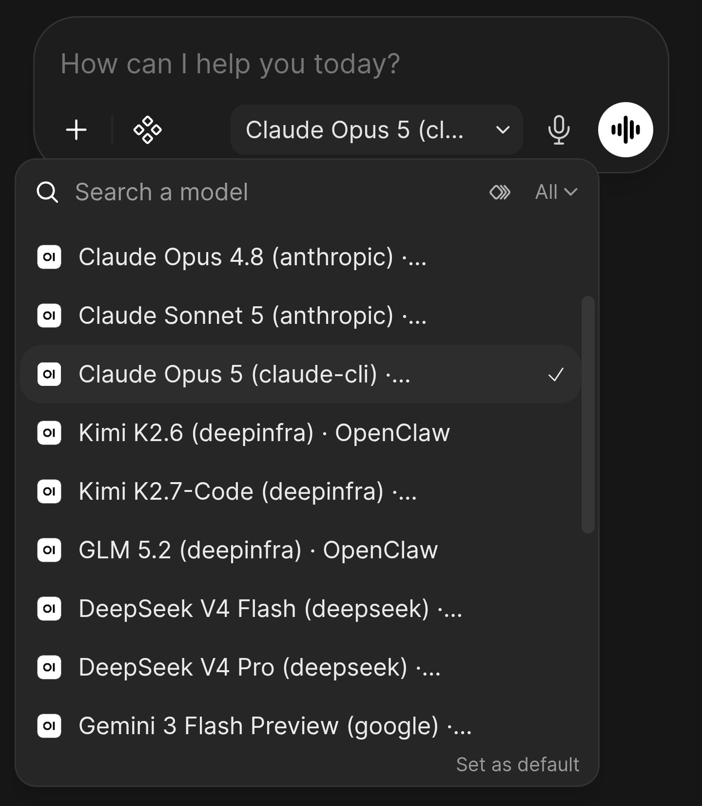
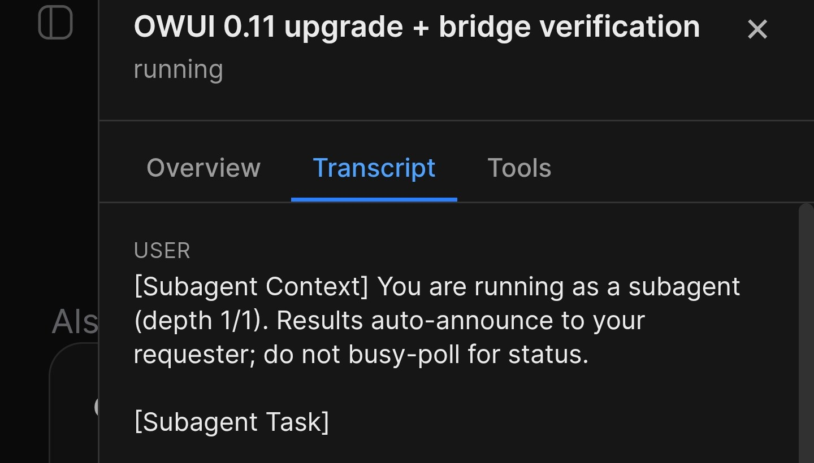
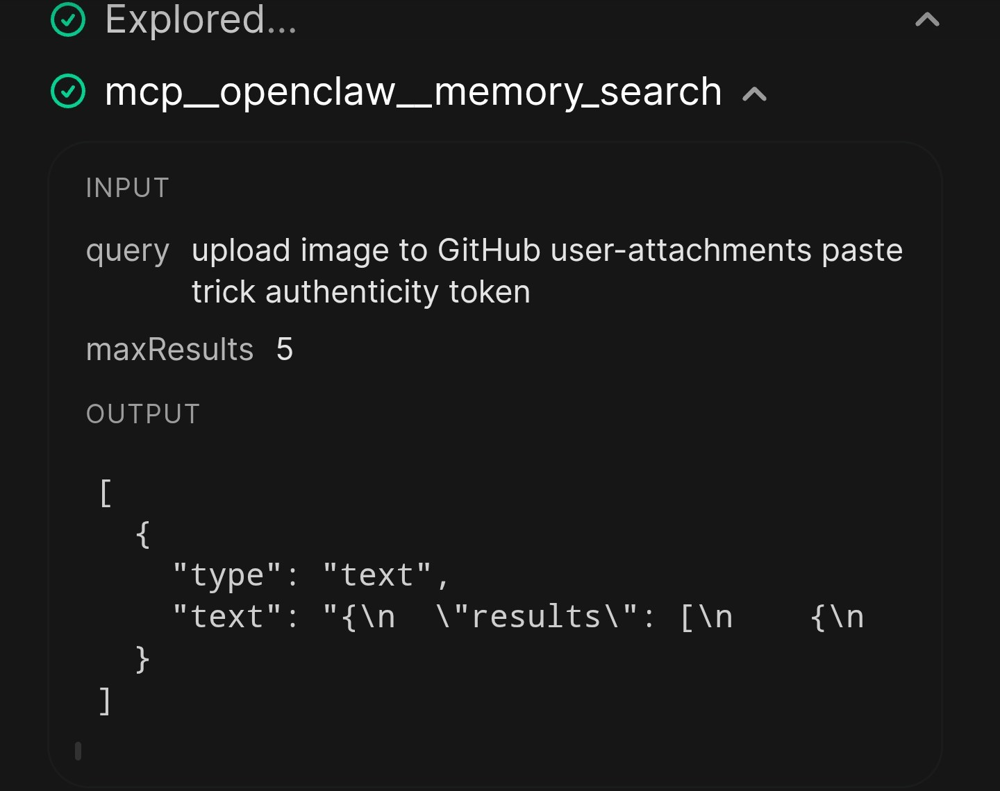

# OpenClaw in Open WebUI 🔌

[](https://github.com/Eliav2/openclaw-openwebui-integration/actions/workflows/ci.yml)
[](./LICENSE)
[](https://www.python.org/downloads/)

Run your [OpenClaw Gateway](https://github.com/openclaw/openclaw) agents inside
[Open WebUI](https://openwebui.com/), with their tool calls, subagents and
mid-run questions rendered as real UI instead of flattened into text.

A [**Pipe**](https://docs.openwebui.com/features/extensibility/plugin/functions/pipe)
function connects as an
[external app](https://docs.openclaw.ai/gateway/external-apps) speaking the
[Gateway's native v4 WebSocket protocol](https://docs.openclaw.ai/gateway/protocol),
which is what buys the real-time streaming, the native tool-call cards, and the
persistent agent sessions. A companion
[**Action**](https://docs.openwebui.com/features/extensibility/plugin/functions/action)
function adds a live session/usage button to the message toolbar. Two files,
nothing else to run, nothing added to your OpenClaw install.

<p align="center">
  
</p>
<p align="center"><sub>Tool calls stream live as the agent works. On a phone.</sub></p>

> **You need a running OpenClaw Gateway before any of this is useful.**
> [OpenClaw](https://github.com/openclaw/openclaw) is a self-hosted agent
> runtime: it runs tool-using agents on your own machine and exposes them over a
> WebSocket gateway. This repo only connects an **existing** Gateway to Open
> WebUI's chat UI. It is not itself an agent. If you don't have a Gateway yet,
> set that up first.

---

## 🎯 Why this exists

I built this because I wanted OpenClaw on my phone.

OpenClaw's built-in chat UI was never somewhere I wanted to hold a long
conversation, least of all on mobile. Open WebUI is polished and mobile-first.
It feels like using ChatGPT or Claude, and I wanted that same experience for my
own agents. So I built this, used it daily for a few months, and I'm now
sharing it.

**The other difference is the connection.** The usual ways to reach OpenClaw
from outside, such as WhatsApp or Telegram, go through OpenClaw's public API,
which is deliberately narrow: text in, text out. This integration speaks the
Gateway's **native v4 WebSocket protocol** instead, the same one OpenClaw's own
clients use.

That is the entire reason the rest of this is possible. A text-in, text-out API
can carry the agent's _answer_; only the native protocol carries the agent's
_work_: every tool call as it happens, the questions it stops to ask you, and
the files it emits. The comparison below shows what that changes in practice;
[Features](#-features) has the full list.

One thing worth calling out separately, because it is not about the protocol:
**your history lives in Open WebUI's database.** It survives Gateway restarts
and agent crashes, stays searchable and exportable, and a turn the Gateway
loses mid-flight is still there in the chat.

<p align="center">
  
</p>
<p align="center"><sub>The companion Action puts this button on every message.</sub></p>

<p align="center">
  
  &nbsp;&nbsp;
  
</p>
<p align="center"><sub>Left: what it opens, fetched live from the Gateway. Right: every model your Gateway knows about, discovered automatically.</sub></p>

<p align="center">
  
</p>
<p align="center"><sub>The status dialog lists the subagents a run spawned; open one to read its transcript. Its tool calls appear once it finishes, see the note in Features.</sub></p>

<p align="center">
  
</p>
<p align="center"><sub>Tap any tool call to see its arguments and result.</sub></p>

<details>
<summary><b>Why not just point Open WebUI at <code>/v1</code>?</b> &mdash; <sub>the official endpoint, and what it does not carry</sub></summary>

You can, and for many people that is the right answer. OpenClaw ships an
official OpenAI-compatible endpoint, and Open WebUI is a documented, CI-tested
client for it. Enable `gateway.http.endpoints.chatCompletions`, point Open WebUI
at `http://your-gateway:18789/v1`, use your Gateway token as the API key, and
pick `openclaw/default`. No install, nothing to maintain. See
[Open WebUI quick setup](https://docs.openclaw.ai/gateway/openai-http-api#open-webui-quick-setup).

The difference is what each one gives you:

|                                                                             | `/v1` endpoint         | This integration                                   |
| --------------------------------------------------------------------------- | ---------------------- | -------------------------------------------------- |
| Setup                                                                       | Change one config flag | Install two functions                              |
| Streams assistant text                                                      | Yes                    | Yes                                                |
| Client-declared OpenAI function tools                                       | Yes                    | Not applicable                                     |
| **The agent's own tool calls,** its shell commands, file edits and searches | Not surfaced           | Rendered live as native tool cards                 |
| **Subagents**                                                               | Not surfaced           | Listed with status, transcript drawer per subagent |
| **Ask-user dialogs** mid-run                                                | No                     | Yes                                                |
| **Agent-emitted images and files**                                          | No                     | Attached natively                                  |
| **Context and rate-limit usage**                                            | No                     | On demand, live                                    |
| Model switching                                                             | One model id           | Every model your Gateway knows, per conversation   |
| Auth                                                                        | Shared bearer token    | Ed25519 device pairing                             |

Put simply: **`/v1` gives you the agent as a model. This gives you the agent as
an agent.** If you want OpenClaw in a model dropdown, use `/v1`. If you want to
watch it work, use this.

</details>

---

## ⚡ Quickstart

```bash
git clone https://github.com/Eliav2/openclaw-openwebui-integration
cd openclaw-openwebui-integration
uv run install.py install --wizard    # prompts for everything it needs
```

Then approve the device once on your Gateway host:

```bash
openclaw devices list
openclaw devices approve <request-id>
```

Now pick **`OpenClaw · Default`** in Open WebUI's model dropdown and say hello.
Full detail, including a manual path, in [Installation](#-installation). If
something goes wrong, jump to [Troubleshooting](#-troubleshooting).

---

## ✨ Features

The complete list. Each entry links to a collapsible block in the
[Feature reference](#-feature-reference) at the bottom of this file, with the
full explanation, the valves that control it, and a screenshot where one exists.

Everything here works the moment the Pipe is installed, except entries marked
**needs agent setup** (the integration provides the mechanism, but your agent has
to know the convention, see [Teaching your agent](#-teaching-your-agent-to-use-this))
and **separate function** (ships as its own file and installs separately).

**In the chat**

- [**🔴 Real-time streaming**](#f-streaming): replies appear token by token, not all at once at the end
- [**🛠️ Native tool-call rendering**](#f-tool-cards): tool calls render as OWUI's own two-phase cards, expandable to their input and output
- [**❌ Tool-failure marking**](#f-tool-failures): failed calls are labelled, and a call that never returns is closed rather than left spinning
- [**❓ Ask-user modal**](#f-ask-user) _(needs agent setup)_: agent questions become real dialogs (text, password, yes/no, single choice, multi-select) that survive a reconnect
- [**🧠 Per-chat thinking control**](#f-thinking) _(separate function)_: a toggle under the message box sets reasoning effort per chat, offering only the levels your models actually support
- [**🖼️ Native media delivery**](#f-media) _(needs agent setup)_: `MEDIA:` files are uploaded to the Open WebUI Files API and attached natively
- [**📎 Image input**](#f-image-input): images you attach are forwarded to the agent
- [**📈 Inline usage and goal line**](#f-status-line): context, rate-limit and goal state under every reply
- [**🏷️ Auto-title**](#f-auto-title): chats name themselves, on a separate agent lane so it never queues behind your conversation

**Sessions and models**

- [**💬 Persistent sessions**](#f-sessions): one stable OpenClaw session per OWUI chat, so the agent remembers context across messages
- [**🧭 Dynamic model selector**](#f-model-selector): one entry per model your Gateway actually knows about, discovered via `models.list`
- [**🔎 Whitelist and size cap**](#f-model-limits): keep the selector short and curated
- [**🕰️ Legacy fixed presets**](#f-legacy-presets): the older ChatGPT/Opus/Sonnet/GLM entries still resolve

**Status and observability**

- [**📊 Status Action button**](#f-status-action) _(separate function)_: context, rate limits and running subagents, fetched live on demand
- [**🗜️ Compact from the dialog**](#f-compact): run `/compact` on the session and watch the numbers change
- [**👥 Subagent drawer**](#f-subagent-drawer) _(partial)_: per-subagent overview, transcript and tools. **Tool calls only appear once the subagent finishes**, see the entry for why
- [**📝 Backend diagnostics**](#f-logging): prefixed logs for every turn, snapshot decision and tool call

**Reliability**

- [**🔌 Persistent connection**](#f-connection): one shared WebSocket, reconnecting on its own with backoff
- [**⏳ Concurrent-message queueing**](#f-queueing): send while the agent is busy and get a real turn, not a blank bubble
- [**♻️ Rehydration and restart safety**](#f-rehydration): reload mid-turn and the partial answer is still there
- [**🧵 Parity finalize**](#f-parity): a turn that ends early completes in place instead of stranding its tail in a second bubble
- [**🩹 Preview recovery**](#f-recovery): lost events fall back to the Gateway's own transcript, and silence is never mistaken for completion
- [**🛑 Stop that actually stops**](#f-stop): aborts the run and kills the tool that is still executing
- [**🧟 Zombie reaping**](#f-reaping): a redeploy never leaves a duplicate connection writing every message twice
- [**🚫 Background-task short-circuiting**](#f-background-tasks): OWUI's own title, tag, follow-up, emoji and autocomplete calls never reach your agent
- [**🧯 Actionable errors**](#f-errors): failures name the valve, the config key and the command that fixes them

**Beyond the chat**

- [**📮 Proactive delivery**](#f-proactive): a cron, heartbeat or `sessions_send` reply lands in your chat with no message from you
- [**🧑‍🔧 Sub-agent results**](#f-subagent-delivery): a finished sub-agent posts into the parent chat, clickable through to its drawer
- [**📡 Live relay**](#f-relay): proactive runs stream into an already-open tab instead of appearing only when finished

**Setup**

- [**🔐 Ed25519 device auth**](#f-device-auth): challenge/response handshake, with a device identity that survives restarts and reinstalls
- [**📦 Installer**](#f-installer): wizard, in-place updates that preserve your valves, backups, healthcheck
- [**⚙️ Valves**](#f-valves): everything configurable from the OWUI admin UI, no file access and no restart

---

## 📦 Three Functions

| File                                                             | OWUI type                                                                                  | Purpose                                                                                                                             |
| ---------------------------------------------------------------- | ------------------------------------------------------------------------------------------ | ------------------------------------------------------------------------------------------------------------------------------------ |
| [`openclaw_pipe.py`](./openclaw_pipe.py)                         | [Pipe](https://docs.openwebui.com/features/extensibility/plugin/functions/pipe) (manifold) | The chat integration. Almost everything above                                                                                       |
| [`openclaw_status_action.py`](./openclaw_status_action.py)       | [Action](https://docs.openwebui.com/features/extensibility/plugin/functions/action)        | Message-toolbar button for on-demand session/usage lookups; reuses the Pipe's live connection and device identity, no second pairing |
| [`openclaw_thinking_filter.py`](./openclaw_thinking_filter.py)   | [Filter](https://docs.openwebui.com/features/extensibility/plugin/functions/filter)        | The per-chat thinking toggle under the message box. Optional, and imports nothing but the standard library and pydantic             |

All three are generated from the same `src/openclaw_pipe_pkg/` source fragments.
See [`docs/development.md`](./docs/development.md) if you're contributing.

---

## 📋 Requirements

| Component                   | Requirement                                                      |
| --------------------------- | ---------------------------------------------------------------- |
| Open WebUI                  | ≥ v0.10.2. Developed and tested against v0.10.2 and v0.11.0      |
| OpenClaw Gateway            | v2025+ (WS protocol v4)                                          |
| Python packages inside OWUI | `websockets`, `cryptography`. `pydantic` already ships with OWUI |

> **Open WebUI version:** native tool-card rendering depends on OWUI's
> Responses-API streaming handler. The integration performs no runtime version check,
> so on older releases tool cards degrade silently rather than erroring.

> **`websockets` / `cryptography`:** both functions declare them in the
> `requirements:` frontmatter field, so Open WebUI pip-installs them itself the
> first time the function loads. If your deployment sets
> `ENABLE_PIP_INSTALL_FRONTMATTER_REQUIREMENTS=false` or runs with
> `OFFLINE_MODE`, install the two packages into the OWUI image yourself.

---

## 🚀 Installation

Two paths, same result. `install.py` drives Open WebUI's REST API, so it needs
your OWUI admin email and password. The manual path needs neither.

<details open>
<summary><b>🤖 Automated</b> &mdash; <sub>one command, needs your OWUI admin password</sub></summary>

#### Prerequisites

- A running OpenClaw Gateway, reachable from the machine Open WebUI runs on
- Admin credentials for your Open WebUI instance
- Your OpenClaw Gateway API token. This is the value of `gateway.auth.token`
  in your OpenClaw config; ask whoever runs your Gateway if you don't have it
- [`uv`](https://docs.astral.sh/uv/) on the **machine running the installer**
  (not inside OWUI). If you don't have it:

  ```bash
  curl -LsSf https://astral.sh/uv/install.sh | sh
  ```

  No `uv`? Plain `pip install cryptography click rich` + `python3 install.py
install` works identically. `uv` just removes that manual step. (A bare
  `python3 install.py` with no subcommand only prints help.)

#### Run the installer

The wizard prompts for everything it needs and explains where to find each
value. Start here:

```bash
uv run install.py install --wizard
```

`uv run` resolves `cryptography`, `click`, and `rich` into an ephemeral
environment, so there is no venv or `pip install` step.

You can also run it without cloning first:

```bash
uv run https://raw.githubusercontent.com/Eliav2/openclaw-openwebui-integration/main/install.py install --wizard
```

In that form there is no `openclaw_pipe.py` next to the script, so the installer
downloads the artifact from this repo before deploying it. Point
`OPENCLAW_PIPE_ARTIFACT_URL` at a fork, a pinned tag, or an internal mirror to
change that.

#### Configuration

Only three values are required. Everything else has a working default:

| Required        |                                                |
| --------------- | ---------------------------------------------- |
| `OWUI_EMAIL`    | Open WebUI admin email                         |
| `OWUI_PASSWORD` | Open WebUI admin password                      |
| `GATEWAY_TOKEN` | `gateway.auth.token` from your OpenClaw config |

| Optional                    | Default                                                                                                    |
| --------------------------- | ---------------------------------------------------------------------------------------------------------- |
| `OWUI_URL`                  | `http://localhost:8080`                                                                                    |
| `GATEWAY_URL`               | `localhost:18789`                                                                                          |
| `AGENT_ID`                  | `main`                                                                                                     |
| `OPENCLAW_BRIDGE_STATE_DIR` | `/data/openclaw-bridge`                                                                                    |
| `OWUI_API_BASE_URL`         | whatever `OWUI_URL` is. Set it only when the pipe must reach OWUI's API at a different address than you do |
| `OWUI_API_KEY`              | empty. Only needed if the request bearer token can't be used for media uploads                             |
| `FILE_SERVER_BASE_URL`      | empty. Only needed if you rely on the legacy media fallback                                                |

Supply them as env vars, or as flags with the same names (`--owui-email`,
`--gateway-token`, ...). `uv run install.py install --help` lists every flag.
Skip the wizard once they are set:

```bash
export OWUI_EMAIL=admin@example.com
export OWUI_PASSWORD=your-password
export GATEWAY_TOKEN=your-gateway-token

uv run install.py install
```

That non-interactive form is what you want for CI, config management, or
reinstalling after an OWUI upgrade.

#### What `install` does

1. Log in to Open WebUI
2. Check whether the Gateway function already exists
3. **If it exists:** update the code in place, preserving every valve including `DEVICE_IDENTITY`
4. **If it's new:** create the function
5. Back up the previous function and valves to `backups/`
6. Ensure it is active and global, without blindly toggling it off first
7. Generate or reuse a permanent device identity (Ed25519 key pair)
8. Restore valves if Open WebUI drops them during the update
9. Run an end-to-end smoke test through `/api/chat/completions`
10. Approve a matching pending pairing request, when the local `openclaw` CLI is available

Step 3 is why re-running this is safe: the function is never deleted and
recreated, so `DEVICE_IDENTITY` survives and you never re-approve the device.

#### Commands

| Command       | What it does                                                                                                                                         |
| ------------- | ---------------------------------------------------------------------------------------------------------------------------------------------------- |
| `install`     | Create or update the Pipe function and its valves, then smoke test                                                                                   |
| `repair`      | Same as `install`. Use after a broken or partial setup                                                                                               |
| `status`      | Print current state, change nothing                                                                                                                  |
| `healthcheck` | Status checks plus an end-to-end smoke test                                                                                                          |
| `skills`      | Install the agent-side skills. Run on the **Gateway host**, needs no OWUI credentials (see [Teaching your agent](#-teaching-your-agent-to-use-this)) |

`install` and `repair` also take `--with-skills` when you happen to be on the
Gateway host, and `--force-skills` to overwrite an existing skill.

</details>

<details>
<summary><b>✋ Manual</b> &mdash; <sub>paste two files in the admin panel, no credentials shared</sub></summary>

An OWUI function is one flat `.py` file. Paste it in the admin panel:

1. Open **Admin Panel** → **Functions** in OWUI
2. Click **"+"** → **"Create a function"** with ID `openclaw_gateway`, type `pipe`
3. Paste the contents of [`openclaw_pipe.py`](./openclaw_pipe.py)
4. Save, then toggle **Active** → **ON** and **Global** → **ON**
5. Set the valves:

   | Valve                 | Description                                                                             |
   | --------------------- | --------------------------------------------------------------------------------------- |
   | `GATEWAY_URL`         | OpenClaw Gateway address, `host:port`, no scheme (default: `localhost:18789`)           |
   | `GATEWAY_TOKEN`       | Your gateway API token                                                                  |
   | `AGENT_ID`            | Which agent to route to (default: `main`)                                               |
   | `DEVICE_IDENTITY`     | Paste from `./.pipe_device_identity.json` after running the script once, or leave empty |
   | `ENABLE_FILE_SERVER`  | `True` (media support)                                                                  |
   | `USE_OWUI_FILES`      | `True` (native OWUI Files API media support)                                            |
   | `OWUI_BASE_URL`       | Open WebUI base URL reachable from the OWUI backend                                     |
   | `SEND_STOP_ON_CANCEL` | `True` (workaround for `chat.abort` not stopping active tool subprocesses)              |

6. Choose `OpenClaw · Default` (or any discovered model) and start chatting

Optionally repeat the same steps for the Status Action, creating an
**Action** function (not a Pipe) with id `openclaw_status_action` and the
contents of [`openclaw_status_action.py`](./openclaw_status_action.py). Turn on
**Global** so the button appears on every model's messages, then set all five of
its valves, `GATEWAY_URL`, `GATEWAY_TOKEN`, `DEVICE_IDENTITY`, `STATE_DIR`,
`AGENT_ID`: to exactly the same values as the Pipe's.

> Do not skip `DEVICE_IDENTITY` here. Without it, a fallback connection from the
> Action registers as a _new_ device and the Gateway raises a second pairing
> request. `uv run install_action.py install` mirrors all five for you.

</details>

---

### Approve the device in the Gateway

A first install pairs a brand-new device, so the Gateway holds it pending until
you approve it. Expect the installer to report **pairing required**; that is the
normal first run, not a failure.

If the installer ran on the Gateway host it approves the request for you. If it
ran anywhere else, approve it yourself, on the Gateway host:

```bash
openclaw devices list      # find the pending request
openclaw devices approve <request-id>
```

**The identity is permanent.** The installer prefers the existing
`DEVICE_IDENTITY` valve, mirrors it into `./.pipe_device_identity.json`, and the
pipe persists it inside `STATE_DIR` on first run. Valve updates are in-place, so
approval lasts across reinstalls and restarts.

---

### Verify it worked

1. Reload Open WebUI. `OpenClaw · Default` should appear in the model picker.
2. Select it and send "hello". Text should stream in token by token.

Automated path only, covers both checks at once:

```bash
uv run install.py healthcheck   # status checks plus an end-to-end smoke test
```

All ✓ and exit 0 means done.

If the smoke test reports **pairing required**, the approval above hasn't landed
yet. Approve the device, then re-run `healthcheck`.

---

### Installing the companion Status Action

`install.py` manages `openclaw_pipe.py`. The Status Action has its own
installer, install the Pipe first, since it is the source of truth for the
shared valves:

```bash
uv run install_action.py install   # create/update the Action, mirror valves from the Pipe, smoke test
uv run install_action.py status    # inspect without changing anything
uv run install_action.py repair    # same as install
```

It reads only `OWUI_URL`, `OWUI_EMAIL`, and `OWUI_PASSWORD`. The five shared
valves, `GATEWAY_URL`, `GATEWAY_TOKEN`, `DEVICE_IDENTITY`, `STATE_DIR`,
`AGENT_ID`: are copied verbatim from the Pipe's valves, so the Action reuses
the Pipe's already-approved device identity and never triggers a second pairing.
It fails fast if the Pipe isn't installed yet.

Two differences from `install.py`: it must be run from a clone (it imports from
`install.py`, so the `uv run <raw-github-url>` form doesn't work), and it has no
`healthcheck` subcommand.

---

### Installing the thinking filter

Optional, and installed by hand rather than by a script. It has no installer
because it has nothing to configure: unlike the Action it shares no valves with
the Pipe, needs no device identity, and never talks to the Gateway itself.

1. Open WebUI → **Admin Panel** → **Functions** → **+**
2. Paste the contents of [`openclaw_thinking_filter.py`](./openclaw_thinking_filter.py)
3. Save, then toggle it **Active**

Leave it global (the default) so the toggle is available in every chat. It does
nothing until you switch it on in a given conversation: Open WebUI does not run
a toggled filter's `inlet` while the toggle is off, so an untouched chat behaves
exactly as if the filter were not installed.

The Pipe should be installed first. The filter's level dropdown is populated
from the ladder cache the Pipe writes, so before the Pipe has run once the
dropdown falls back to the five levels every observed provider supports. See
[Per-chat thinking control](#f-thinking).

---

### Uninstalling

There's no `uninstall` subcommand; removal is a UI action. In Open WebUI go to
**Admin Panel → Functions** and delete `openclaw_gateway` (and
`openclaw_status_action` if you installed it). Every install first writes the
previous function and its valves to `backups/`, so if you only want to roll back
a bad upgrade, restore the JSON from there rather than deleting.

Deleting the functions does not touch `STATE_DIR`. Remove that directory too if
you want the device identity gone, and revoke the device on the Gateway with
`openclaw devices list` / `openclaw devices remove <id>`.

---

## ⚙️ Configuration reference

Behaviour you can tune after the integration is running. None of it is
needed for a first install.

### Restart-safe state

The integration loads identity in this order:

1. `STATE_DIR/identity.json` (default: `/data/openclaw-bridge/identity.json`)
2. `DEVICE_IDENTITY` valve, then persists it into `STATE_DIR`
3. Generate a new identity only if neither exists

The Gateway device token is saved to `STATE_DIR/device-token.json` after a
successful connection. This keeps OWUI restarts and pipe reloads from creating
new devices or requiring repeated approvals.

> **If `STATE_DIR` isn't writable**, the integration falls back to
> `/tmp/openclaw-bridge` and logs `STATE_DIR unavailable`. `/tmp` usually does
> not survive a container restart, so identity and device token are lost and
> you get a fresh pairing prompt every time. If OWUI keeps asking you to
> re-approve the device, grep the backend log for `STATE_DIR unavailable` and
> point `STATE_DIR` at a real persistent volume. `/data` is not mounted in
> every OWUI deployment.

### OWUI model selector

The integration is a manifold function: `pipes()` calls the Gateway's `models.list`
RPC (falling back to a cached list, then a small hardcoded list, if the
Gateway is unreachable) and returns one selector entry per discovered model,
plus an always-present `OpenClaw · Default` entry. Selecting a model patches
that OWUI conversation's OpenClaw session to that model; switching back to
`Default` clears the override and returns to the agent's configured default.

Relevant valves:

| Valve               | Description                                                                                                 |
| ------------------- | ----------------------------------------------------------------------------------------------------------- |
| `CONFIGURED_MODELS` | Comma-separated whitelist of model keys to show. Empty = show all discovered models.                        |
| `DEFAULT_MODEL`     | Model used when `OpenClaw · Default` is selected. Also doubles as a reference dropdown of known model keys. |
| `MAX_MODELS`        | Safety cap on how many models the selector lists when there's no whitelist (default `30`).                  |

> **Legacy presets.** The `CHATGPT_MODEL`, `OPUS_MODEL`, `SONNET_MODEL`, and
> `GLM_MODEL` valves still produce fixed selector entries, purely so
> conversations that already picked one keep working. Ignore them on a new
> install; dynamic discovery replaces them.

### Auto-generated chat titles

When `AUTO_TITLE` is enabled (default), the integration generates a chat title after
the first exchange, similar to native OWUI behavior. Title generation runs on
a separate agent lane (`TITLE_GEN_AGENT_ID`, default `title-gen`) so it never
queues behind, or pollutes, the main conversation's session.

### Native OWUI media delivery

When the agent emits a `MEDIA:<filename>` directive and the file exists in the
pipe media directory, the integration now tries this path first:

1. Upload the file to `POST /api/v1/files/?process=false`
2. Emit a `files` event so Open WebUI attaches the file to the assistant message
3. Yield same-origin markdown such as
   ``

This avoids mixed-content blocking when OWUI is opened over HTTPS. If upload
auth is unavailable or the Files API fails, the integration falls back to the legacy
`FILE_SERVER_BASE_URL` behavior.

Relevant valves:

| Valve                  | Description                                                                                                                                                                                                                                                                 |
| ---------------------- | --------------------------------------------------------------------------------------------------------------------------------------------------------------------------------------------------------------------------------------------------------------------------- |
| `USE_OWUI_FILES`       | Enable OWUI Files API upload for `MEDIA:` directives (default: `True`)                                                                                                                                                                                                      |
| `OWUI_BASE_URL`        | Base URL the integration uses to call the OWUI Files API (default: `http://127.0.0.1:8080`). The integration runs inside the OWUI backend, so the loopback default is usually correct.                                                                                      |
| `OWUI_API_KEY`         | Optional API key for uploads; the current request bearer token is preferred (default: empty)                                                                                                                                                                                |
| `FILE_SERVER_BASE_URL` | Legacy fallback base URL for the built-in media file server, used only when `USE_OWUI_FILES` is off or an upload fails (default: `http://localhost:18791`). The **browser** resolves this URL, not OWUI, so the default only works when you browse OWUI from the same host. |
| `SEND_STOP_ON_CANCEL`  | Send `/stop` after `chat.abort` when OWUI cancels a stream (default: `True`)                                                                                                                                                                                                |

---

## 🔧 Troubleshooting

| Symptom                                               | Likely cause                                                                                                                                                                                                                                                                                                                                                   |
| ----------------------------------------------------- | -------------------------------------------------------------------------------------------------------------------------------------------------------------------------------------------------------------------------------------------------------------------------------------------------------------------------------------------------------------- |
| Text appears all at once                              | Pipe uses `return` instead of `yield` (check your code)                                                                                                                                                                                                                                                                                                        |
| "No GATEWAY_TOKEN configured"                         | Valve not set, go to Admin → Functions → edit valves                                                                                                                                                                                                                                                                                                           |
| An `**Error:**` line instead of a reply               | OWUI can't reach `GATEWAY_URL`: check network connectivity from the OWUI backend                                                                                                                                                                                                                                                                               |
| Model missing from selector                           | Run `uv run install.py repair`; it ensures the function is active/global and visible in `/api/v1/models`. Also check `CONFIGURED_MODELS` isn't filtering it out.                                                                                                                                                                                               |
| "pairing required"                                    | Run `uv run install.py repair` or approve the matching request with `openclaw devices approve <request-id>`                                                                                                                                                                                                                                                    |
| Image still uses the legacy file server               | OWUI file upload failed and the integration fell back; check `OWUI_BASE_URL`, request auth/API key, and OWUI logs                                                                                                                                                                                                                                              |
| Tool calls not showing                                | The `__event_emitter__` calls fail silently; check OWUI backend logs                                                                                                                                                                                                                                                                                           |
| Device identity not persisting                        | Check `STATE_DIR` and the `DEVICE_IDENTITY` valve; run `uv run install.py healthcheck`                                                                                                                                                                                                                                                                         |
| Stream stops mid-response                             | The integration probes the Gateway after 30s of silence and gives up after 180s with no text; check agent response time and the OWUI backend log                                                                                                                                                                                                               |
| Repeated device-pairing prompts                       | `STATE_DIR` isn't persistent, grep the OWUI backend log for `STATE_DIR unavailable`                                                                                                                                                                                                                                                                            |
| `ModuleNotFoundError: websockets` on load             | OWUI's frontmatter auto-install is off (`ENABLE_PIP_INSTALL_FRONTMATTER_REQUIREMENTS=false`) or it's in offline mode, install `websockets` and `cryptography` into the OWUI image                                                                                                                                                                              |
| Models are listed as "- example, Gateway not reached" | The integration hasn't reached your Gateway yet, so the selector is showing a built-in example list rather than your models. Pick `OpenClaw · Default` (it always works), send one message to establish the connection, then reload, the real list replaces it. If it persists, the Gateway is genuinely unreachable: check `GATEWAY_URL` and `GATEWAY_TOKEN`. |
| "Could not start a session on agent `<id>`"           | `AGENT_ID` names an agent your Gateway doesn't define. Use `main` unless you configured others.                                                                                                                                                                                                                                                                |
| Restarting mid-turn loses context                     | Known OpenClaw limitation, avoid restarting the Gateway while a run is in flight                                                                                                                                                                                                                                                                               |

Check OWUI's backend logs for `[openclaw-pipe]` prefixed messages.

---

## 🤖 Teaching your agent to use this

Two features need the **agent** to know a convention. The integration provides
the mechanism, but nothing tells your model it exists, so out of the box the
agent will never use them:

| Feature               | The agent must                            | Otherwise                                                   |
| --------------------- | ----------------------------------------- | ----------------------------------------------------------- |
| Ask-user dialog       | Start a line with `OpenClaw needs input:` | It calls its own ask tool, which never reaches you here     |
| Send an image or file | Emit `MEDIA:<bare-filename>`              | An absolute path silently drops, with no image and no error |

Two skills ship with this repo. Install them **on the Gateway host**, which is
where the agent runs and is not always where Open WebUI runs:

```bash
openclaw skills install ./skills/openclaw-owui-ask-user
openclaw skills install ./skills/openclaw-owui-media
```

Or let the installer do it, if you are already on the Gateway host:

```bash
uv run install.py install --with-skills   # during install
uv run install.py skills                  # any time afterwards
```

It detects the local `openclaw` CLI. If the Gateway is on another machine, it
says so and prints the commands to run there instead.

**Updating:** `git pull`, then re-run the same command with `--force-skills`
(or `openclaw skills install ... --force`). Overwriting is opt-in on purpose:
OpenClaw keeps no history for skill installs, so an overwrite is unrecoverable,
and a skill you wrote yourself should never be clobbered by an installer.

If you would rather not install anything, put the two conventions in your
agent's own instructions. The skills are only a convenient carrier.

---

## 📖 Feature reference

Every entry in [Features](#-features) links here. Expand one for the full
explanation, the valves that control it, and a screenshot where one exists.

### In the chat

<a id="f-streaming"></a>
<details>
<summary><b>🔴 Real-time streaming</b></summary>

Assistant text is yielded token by token as the Gateway emits it, so a long
answer starts appearing immediately instead of landing in one block at the end.

Two provider quirks are handled so you never see them. Some runtimes resend the
entire reply as a final cumulative frame; the Pipe recognises text it has
already shown and suppresses the repeat rather than printing the answer twice.
Other events carry their text as a whole item rather than as deltas, and that
text is relayed too instead of being dropped.

Internal scaffolding never reaches the bubble either: the Sender provenance
block (see [`docs/metadata-contract.md`](./docs/metadata-contract.md)) and the
silent sentinels an agent uses to mean "say nothing" are both filtered out.

Always on.

</details>

<a id="f-tool-cards"></a>
<details>
<summary><b>🛠️ Native tool-call rendering</b></summary>

Tool calls are yielded as Responses-API output items, which means Open WebUI
renders them with its own two-phase tool card: a spinner while the tool runs,
the result when it finishes. Nothing here is hand-rolled HTML, so the cards
match the rest of the UI and survive a reload.

<p align="center">
  
</p>

Expand a card to see the arguments the agent passed and the result it got back.
Arguments are capped at 3000 characters and results at 8000, so one enormous
tool result cannot bury the conversation.

<p align="center">
  
</p>

Calls that arrive without a tool-call id, and the shadow renderer used as a
fallback, degrade to a markdown `<details type="tool_calls">` card rather than
disappearing. The status row under the message tracks the same events in words:
"Running \<tool\>…" then "\<tool\> done".

Always on. Native cards need Open WebUI 0.10.2 or newer; on older releases they
degrade quietly rather than erroring.

</details>

<a id="f-tool-failures"></a>
<details>
<summary><b>❌ Tool-failure marking and orphan closing</b></summary>

A tool call that fails gets its card row relabelled to `<name> ❌`, and the mark
is part of the persisted item, so it is still there after a reload. The expanded
output opens with an explicit `❌ tool call failed` banner, which is also the
fallback whenever the relabel cannot fire (it only applies while the failed call
is still the last item).

A tool that was announced but never produced a result, because the run was
cancelled or the agent crashed, is closed out at the end of the turn with
"(no result, the run ended first)". A card left spinning forever is
indistinguishable from a hung UI, so it is never left that way.

Always on.

</details>

<a id="f-ask-user"></a>
<details>
<summary><b>❓ Ask-user modal</b> <sub>(needs agent setup)</sub></summary>

When the agent emits a line beginning with `OpenClaw needs input:` (or
`Codex needs input:`), the integration intercepts it and pops a real Open WebUI
dialog mid-run, instead of leaking the raw prompt into the chat as text that
nobody can answer.

The dialog shape is inferred from the question:

| Question looks like                        | You get                                  |
| ------------------------------------------ | ---------------------------------------- |
| anything else                              | a titled free-text input                 |
| mentions secret, password, api key, token  | a masked password field                  |
| `(y/n)`, or a confirm verb plus `?`        | a native yes/no confirmation             |
| two or more numbered options               | clickable themed choice buttons          |
| `(multiselect)` or "select all that apply" | checkboxes plus a Submit button          |

Confirmation and multi-select markers are recognised in English, Hebrew and
Arabic.

It is robust to the ways the trigger can arrive: recognised even when streamed
one character at a time, or when it shows up mid-reply inside one cumulative
chunk. A prompt emitted twice does not become a doubled dialog, and duplicate
options are collapsed.

The question survives a reconnect. Close the tab, come back later, and it
re-pops on your new session for up to an hour, re-firing on each reconnect while
the status line reads "Waiting for your reply, question is pending, reconnect
anytime". If you dismiss it, the question appears as ordinary text with the
marker line stripped, so nothing is lost. Once answered, the exchange is kept
inline as a collapsible ❓ Ask User card showing both the question and your
answer, and the run continues in the same bubble.

Your agent has to know the convention, see
[Teaching your agent](#-teaching-your-agent-to-use-this). Implementation in
[`src/openclaw_pipe_pkg/askuser.py`](./src/openclaw_pipe_pkg/askuser.py).

_No screenshot yet._

</details>

<a id="f-thinking"></a>
<details>
<summary><b>🧠 Per-chat thinking control</b> <sub>(separate function)</sub></summary>

Install [`openclaw_thinking_filter.py`](./openclaw_thinking_filter.py) and a
brain-icon toggle appears in the row under the message box. Turn it on for a
chat and pick a level in Chat Controls → Valves: `default`, `off`, `minimal`,
`low`, `medium`, `high`, `xhigh`, `max`, `ultra`.

`default` is not a level, it is the absence of one. It sends no `thinking` field
at all and leaves whatever the agent is configured for alone. `off` is
different: it is an explicit instruction not to think, and it does override the
agent's setting.

The dropdown only offers levels a model on your Gateway actually supports. The
Pipe reads each session's real ladder from the `sessions.describe` it already
makes before every send, so this costs no extra round trip, and folds what it
sees into a cache the filter reads at import time. Until the Pipe has run once,
the dropdown falls back to the five levels every observed provider supports.

Because Open WebUI builds a valve dropdown once from the class, the list is the
union across the models your Gateway knows about, not the ladder of the model
you have selected right now. The Pipe closes that gap at send time by clamping
the request down to the nearest level the current model does support, and saying
so in the chat:

> _This model does not support thinking level 'ultra', using 'high' instead._

Clamping is only ever downward. Asking for less thinking than requested is a
safe degradation; quietly asking for more shows up on someone's bill.

The filter and Open WebUI's own Advanced Params reasoning-effort control write
the same `reasoning_effort` field, so the two are one setting rather than two
that fight over it. `override_advanced_params` (on by default) decides who wins
when both are set; turn it off to let Advanced Params own the value and use the
toggle only to enable thinking.

The filter imports nothing but the standard library and pydantic. A filter runs
on every message, so an import it does not need is an outage it does not need.

Valves: `priority`, `override_advanced_params`, and the per-user `level`.

_No screenshot yet._

</details>

<a id="f-media"></a>
<details>
<summary><b>🖼️ Native media delivery</b> <sub>(needs agent setup)</sub></summary>

When the agent emits `MEDIA:<file>`, the file is uploaded to Open WebUI's own
Files API and attached to the assistant message. The rendered URL is
same-origin, so it works over HTTPS with no mixed-content warnings, and the file
also appears as a real attachment chip on the message.

Images render inline, other file types render as a link, and anything
unrecognised falls back to inline code rather than a broken embed. Several
`MEDIA:` directives in one reply all resolve, not just the first.

The directive is recognised even when streaming splits it mid-prefix or
mid-filename, and one still buffered when the run ends is flushed rather than
dropped. Writing "the MEDIA: fix" in ordinary prose does not turn the next word
into a broken image link.

A plain HTTP file server on port 18791 remains as a fallback, and doubles as an
upload endpoint the agent can `PUT` to. It reaps its own stale instance across
redeploys, so a reinstall never leaves a dead server squatting the port.

Valves: `USE_OWUI_FILES` (on), `OWUI_BASE_URL`, `OWUI_API_KEY`,
`ENABLE_FILE_SERVER` (on), `FILE_SERVER_BASE_URL`. The fallback server is
unauthenticated, see [Security notes](#-security-notes).

</details>

<a id="f-image-input"></a>
<details>
<summary><b>📎 Image input</b></summary>

An image you attach in Open WebUI is forwarded to the agent as a `chat.send`
attachment, so vision-capable models can actually see it.

An image the Pipe cannot forward (anything not delivered as base64) produces an
explicit note that it could not be relayed, rather than an answer confidently
describing a picture the agent never received.

Always on.

</details>

<a id="f-status-line"></a>
<details>
<summary><b>📈 Inline usage and goal line</b></summary>

After every reply, a status row shows where you stand:

> 🧠 45k/200k (22.5%) · ⏱ 5h 18% left (resets in 22m)

One row per window that reports a reset, and a goal line when the session has
one (`🎯 Pursuing goal (12k/50k)`, with paused, blocked, usage-limited and
complete variants).

Each fact is emitted as its own event, because Open WebUI clamps a status row to
a single line and a combined string loses its numbers off the right edge.

The data comes from `sessions.describe` and `usage.status` fetched concurrently,
and the whole thing is best-effort: if either call fails, the reply is
unaffected.

Always on.

</details>

<a id="f-auto-title"></a>
<details>
<summary><b>🏷️ Auto-title</b></summary>

After the first exchange, the chat names itself with a short title and an emoji.

Generation runs on a separate agent lane (`title-gen`) and as a background task,
so it never queues behind your conversation and a failure never surfaces. Model
output is trimmed of quotes, extra lines and excess length before it becomes the
title. If the `title-gen` agent does not exist on your Gateway, the feature
skips silently.

Valve: `AUTO_TITLE` (on). See
[Auto-generated chat titles](#auto-generated-chat-titles) for the agent setup.

</details>

### Sessions and models

<a id="f-sessions"></a>
<details>
<summary><b>💬 Persistent sessions</b></summary>

Each Open WebUI conversation maps to a stable OpenClaw session key,
`agent:{AGENT_ID}:openwebui-{user_id}-{chat_id}`, so the agent remembers context
across messages and across restarts of either side.

The agent also receives a provenance block naming the chat id, the user id and
`source=openwebui`, which is what lets it tell an Open WebUI conversation apart
from a Telegram one. Full contract in
[`docs/metadata-contract.md`](./docs/metadata-contract.md).

Valve: `AGENT_ID`.

</details>

<a id="f-model-selector"></a>
<details>
<summary><b>🧭 Dynamic model selector</b></summary>

The integration calls `models.list` and lists one selector entry per model your
Gateway actually knows about, named `<Model> (<provider>) · OpenClaw`.

<p align="center">
  
</p>

`OpenClaw · Default` is always present and always works: picking it clears the
model override and uses the agent's own model.

Discovered models are cached, so the selector still shows your real models after
a restart, before the first connection is made. Models that could not be
verified against a live Gateway are labelled "example, Gateway not reached", in
the selector and in the `DEFAULT_MODEL` dropdown both, so a placeholder can
never quietly pass for one of yours.

Model keys containing dots (`gemini-3.1-pro-preview`) route correctly, and
runtime namespaces (`claude-cli/`, `codex-cli/`, `google-gemini-cli/`) are
treated as equivalent to their provider, so a correctly applied override is
never reported as failed. A burst of messages collapses into one
`sessions.patch` rather than one per message.

Valves: `DEFAULT_MODEL` (rendered as a live dropdown, not a text box),
`STATE_DIR`. More in [OWUI model selector](#owui-model-selector).

</details>

<a id="f-model-limits"></a>
<details>
<summary><b>🔎 Whitelist and size cap</b></summary>

`CONFIGURED_MODELS` restricts the selector to a list of model keys you name.
Leave it empty to list everything.

`MAX_MODELS` caps how many entries can appear at all, defaulting to 30 and
accepting 1 to 100. A Gateway that knows about two hundred models should not
produce a two-hundred-entry dropdown.

</details>

<a id="f-legacy-presets"></a>
<details>
<summary><b>🕰️ Legacy fixed presets</b></summary>

Before the selector was dynamic, the integration shipped four fixed entries:
ChatGPT, Opus, Sonnet and GLM. Chats that picked one of those still resolve, so
old conversations keep working.

They exist only for backward compatibility. New chats should use the dynamic
entries.

Valves: `CHATGPT_MODEL`, `OPUS_MODEL`, `SONNET_MODEL`, `GLM_MODEL`.

</details>

### Status and observability

<a id="f-status-action"></a>
<details>
<summary><b>📊 Status Action button</b> <sub>(separate function)</sub></summary>

[`openclaw_status_action.py`](./openclaw_status_action.py) adds a button to the
message toolbar.

<p align="center">
  
</p>

It opens a dialog with three sections: Context, Rate Limits and Subagents.

<p align="center">
  
</p>

Each section has its own skeleton and fills the moment its own RPC resolves, so
a slow subagent list does not hold up the context number. Usage bars are colour
coded, green under 60%, amber from 60%, red from 85%, with the colours inlined
so a theme cannot render them invisible.

The footer says when it last refreshed and whether it reused the Pipe's live
connection or opened its own. It reuses the Pipe's connection when one is open
and otherwise falls back to the Pipe's on-disk identity, so there is never a
second pairing to approve. The Action can never deliver proactive messages: that
path is compiled out of this artifact, so its fallback connection cannot write
stray text into a chat.

Valves (mirrored from the Pipe by `install_action.py`): `GATEWAY_URL`,
`GATEWAY_TOKEN`, `DEVICE_IDENTITY`, `STATE_DIR`, `AGENT_ID`. Install steps in
[Installing the companion Status Action](#installing-the-companion-status-action).

</details>

<a id="f-compact"></a>
<details>
<summary><b>🗜️ Compact from the dialog</b></summary>

A Compact pill in the status dialog header runs `/compact` on the session, shows
a distinct "Compacting…" state while it works, and refreshes with the
post-compaction numbers so you can see what it bought you.

Bounded at 180 seconds, matching `openclaw sessions compact`'s own default RPC
timeout. If a response is currently in progress the button refuses with "a
response is currently in progress", rather than compacting the session out from
under a running turn.

</details>

<a id="f-subagent-drawer"></a>
<details>
<summary><b>👥 Subagent drawer</b> <sub>(partial)</sub></summary>

The status dialog lists the subagents a run spawned with their status and
elapsed time. Click one to open a side drawer with Overview, Transcript and
Tools tabs, refreshed by a poll loop that holds open until the subagent
terminates.

<p align="center">
  
</p>

Overview shows the child's own context fill, its goal line, and its
provider/model, which is often not the parent's.

**Its tool calls only appear once it finishes.** The Gateway routes tool events
to the connection that started a run, and a subagent's run starts inside the
Gateway, so no client can watch a running subagent's tool calls. This is a
routing limitation rather than a rendering bug: it was measured and is pinned by
a test, see
[`src/openclaw_pipe_pkg/gateway.py`](./src/openclaw_pipe_pkg/gateway.py).

</details>

<a id="f-logging"></a>
<details>
<summary><b>📝 Backend diagnostics</b></summary>

Every turn logs to the Open WebUI backend log with an `[openclaw-pipe]` prefix:
session key, run id, event count, tool starts and results, and every snapshot
decision with its reason.

There is enough there to diagnose the failure modes that are otherwise
invisible. Duplicate completions log a message id and a text hash, so a re-fired
completion is identifiable. A turn that produced no text at all is marked
`[diag] PHANTOM (no text)`. Snapshot decisions log `EMITTED` or `SKIPPED` with
the deciding condition, and the terminal line records whether the turn was
aborted, whether text was visible, and whether it was snapshotted.

Always on, not configurable.

</details>

### Reliability

<a id="f-connection"></a>
<details>
<summary><b>🔌 Persistent connection</b></summary>

One WebSocket connection is shared by every chat, rather than one per message.

It reconnects on its own with exponential backoff from 1 second up to 30, so a
Gateway restart needs nothing from you. A keepalive tick and a 90 second receive
timeout mean a silently dead socket is detected rather than waited on forever.

Valves: `GATEWAY_URL`, `GATEWAY_TOKEN`. The full message path is in
[`docs/architecture.md`](./docs/architecture.md).

</details>

<a id="f-queueing"></a>
<details>
<summary><b>⏳ Concurrent-message queueing</b></summary>

Send a message while the agent is still working and you get
"⏳ Queued behind the current response…", then a real turn of your own when the
current one finishes. What you do not get is a blank bubble, which is what the
naive implementation produces.

Liveness is read from `sessions.describe` plus `sessions.list`'s
`hasActiveRun`, which is authoritative across multiple Open WebUI worker
processes. It also correctly handles the gap where a parent is suspended waiting
on a sub-agent: that session is busy, not finished, and a 2 second
settle-confirm keeps it from being misread. A per-session send lock means two
messages released at the same moment cannot both merge into one run.

Safety ceiling of 1800 seconds. Always on.

</details>

<a id="f-rehydration"></a>
<details>
<summary><b>♻️ Rehydration and restart safety</b></summary>

Reload the page mid-turn, or open the chat on another device, and you see the
partial answer so far instead of an empty bubble. The Pipe persists a snapshot
of the message as it streams, throttled to at most one per second or per 250
characters.

If your tab or socket dies mid-stream, a forced terminal snapshot means the
finished text is still in the database when you come back.

Device identity and token persist in `STATE_DIR`, so restarting Open WebUI or
reloading the function never forces a re-pairing. If `STATE_DIR` is not
writable, the Pipe degrades to `/tmp/openclaw-bridge` and logs
`STATE_DIR unavailable` loudly rather than failing.

Valve: `STATE_DIR`, default `/data/openclaw-bridge`. Design notes in
[`docs/rehydration-persistence.md`](./docs/rehydration-persistence.md), and see
[Restart-safe state](#restart-safe-state).

</details>

<a id="f-parity"></a>
<details>
<summary><b>🧵 Parity finalize</b></summary>

If the inline turn ends before the run does, the original message is completed
in place with the full text and all of its tool cards, instead of the remainder
stranding in a second detached bubble below it.

Needs a stable Open WebUI message id to target. Always on when there is one.

</details>

<a id="f-recovery"></a>
<details>
<summary><b>🩹 Preview recovery and idle probing</b></summary>

If events are lost, the reply is recovered from the Gateway's own
`sessions.preview` rather than showing you nothing.

Silence is never treated as completion. A long tool call or a long stretch of
silent reasoning triggers a probe every 30 seconds that confirms the run is
still alive, rather than truncating the turn.

There are still bounds, because hanging forever is its own failure: the turn
gives up after 180 seconds with no text at all, or 5000 events without text, and
says so explicitly. When a run does end without text, the reason comes from the
run's real terminal state, so you see **Stopped.** or **Failed: the run did not
complete.** rather than a generic timeout.

Always on.

</details>

<a id="f-stop"></a>
<details>
<summary><b>🛑 Stop that actually stops</b></summary>

The stop button aborts the Gateway run and, by default, also sends `/stop`, so a
tool that is currently executing is actually killed rather than left running
against a conversation nobody is reading.

A final snapshot is persisted before the abort, so stopping does not lose the
partial answer.

Valve: `SEND_STOP_ON_CANCEL` (on).

</details>

<a id="f-reaping"></a>
<details>
<summary><b>🧟 Zombie reaping</b></summary>

Redeploying the function does not leave the previous instance's connection alive
in the background, which would otherwise write every message into your chat
twice. Stale connections and stale file servers are both reaped through shared
bookkeeping that survives the module reload.

Always on.

</details>

<a id="f-background-tasks"></a>
<details>
<summary><b>🚫 Background-task short-circuiting</b></summary>

Open WebUI generates titles, tags, follow-ups, emoji, autocomplete suggestions
and search queries by quietly calling the selected model. Pointed at an agent,
that means six extra runs against your real session: wasted tokens, polluted
context, and confusing entries in the agent's own history.

All six are short-circuited before they reach the Gateway.

Always on, not configurable.

</details>

<a id="f-errors"></a>
<details>
<summary><b>🧯 Actionable errors</b></summary>

Failures name the thing that fixes them.

An unapproved device gets the exact commands, `openclaw devices list` and
`openclaw devices approve <request-id>`, plus this device's id. A bad token
names both the valve and the config key `gateway.auth.token`. A `GATEWAY_URL`
pasted with a scheme is caught explicitly instead of failing cryptically further
down.

A wrong `AGENT_ID` says "Could not start a session on agent `x`" rather than
sending you off to fix `DEFAULT_MODEL`, which is the misattribution the obvious
implementation makes. Where the cause is genuinely ambiguous the message says so
instead of guessing, and a timeout says it is usually transient and to send
again.

Always on. Symptom-first index in [Troubleshooting](#-troubleshooting).

</details>

### Beyond the chat

<a id="f-proactive"></a>
<details>
<summary><b>📮 Proactive delivery</b></summary>

A reply the agent produces without you asking, from a cron job, a heartbeat, or
another session's `sessions_send`, appears in your chat as an
_↳ Proactive message_ bubble with no user turn above it.

It waits for the conversation to be genuinely idle first (120 seconds, polled,
giving up after 600), so it never injects itself into a conversation you are
actively using, and it never duplicates something already delivered live. An
open tab is nudged to refresh so the message appears without you reloading.

Open WebUI models a message with no preceding user turn as a variant, which
would hide it behind a 1/2 · 2/2 swipe arrow. That is healed at the start of
every turn, so proactive messages sit in the normal linear flow.

Enabled by default (`PROACTIVE_DELIVERY_ENABLED`, a module constant rather than
a valve). Compiled out of the Action artifact entirely.

_No screenshot yet._

</details>

<a id="f-subagent-delivery"></a>
<details>
<summary><b>🧑‍🔧 Sub-agent results</b></summary>

When a sub-agent finishes, its result is delivered into the parent Open WebUI
chat as an _↳ Sub-agent_ bubble, carrying a hidden task id.

Clicking the toolbar button on one of those messages opens that sub-agent's
[drawer](#f-subagent-drawer) directly, rather than the general status dialog.

Enabled by default.

</details>

<a id="f-relay"></a>
<details>
<summary><b>📡 Live relay</b></summary>

A proactive run streams token by token into an already-open tab, rather than
appearing all at once when it finishes.

Same sustained-idle contract as post-hoc delivery: a run is only eligible once
its session has had no consumers for 120 seconds. When relay owns a run it
claims that run's delivery identity, so the post-hoc path skips it and you never
get the message twice. Database persistence is explicit on this path, which is
what makes a reload correct regardless of what the browser received.

Enabled by default (`LIVE_STREAM_RELAY_ENABLED`, with
`LIVE_STREAM_BOOTSTRAP_ENABLED` for the refresh nudge). Both are module
constants and can be set to `False` to fall back to post-hoc delivery.

</details>

### Setup

<a id="f-device-auth"></a>
<details>
<summary><b>🔐 Ed25519 device auth</b></summary>

The WebSocket handshake is a full challenge/response against an Ed25519 keypair
generated on first run. You approve the device once on the Gateway host and
never again: the identity and the issued token persist in `STATE_DIR` and
survive Open WebUI restarts, function reloads and in-place reinstalls.

`DEVICE_IDENTITY` holds a private key, see
[Security notes](#-security-notes). Approval steps in
[Approve the device in the Gateway](#approve-the-device-in-the-gateway).

</details>

<a id="f-installer"></a>
<details>
<summary><b>📦 Installer</b></summary>

`install.py install --wizard` prompts for everything it needs. Reinstalling
updates in place and preserves your existing valves, so an update never wipes
`DEVICE_IDENTITY` and forces a re-pairing, and the previous function and valves
are written to `backups/` first either way.

`status`, `repair` and `healthcheck` subcommands inspect, fix and end-to-end
smoke-test the installation. When run on the Gateway host, the installer
approves its own pairing request using the local `openclaw` CLI.

`--with-skills` also installs the two agent-side skills that teach an agent to
use the ask-user modal and the media path. `install_action.py` installs the
Action and mirrors the five shared valves from the Pipe.

Full detail in [Installation](#-installation) and [Commands](#commands).

</details>

<a id="f-valves"></a>
<details>
<summary><b>⚙️ Valves</b></summary>

Everything configurable is an Open WebUI valve, editable from Admin → Functions
with no file access and no restart.

Connection: `GATEWAY_URL`, `GATEWAY_TOKEN`, `AGENT_ID`, `DEVICE_IDENTITY`,
`STATE_DIR`.
Models: `DEFAULT_MODEL`, `CONFIGURED_MODELS`, `MAX_MODELS`, plus the four legacy
preset valves.
Behaviour: `AUTO_TITLE`, `SEND_STOP_ON_CANCEL`, `USE_OWUI_FILES`,
`OWUI_BASE_URL`, `OWUI_API_KEY`, `ENABLE_FILE_SERVER`, `FILE_SERVER_BASE_URL`.
Thinking filter: `priority`, `override_advanced_params`, and the per-user
`level`.

A handful of behaviours are module constants rather than valves, because they
change the integration's contract rather than tuning it:
`PROACTIVE_DELIVERY_ENABLED`, `LIVE_STREAM_RELAY_ENABLED`,
`LIVE_STREAM_BOOTSTRAP_ENABLED`.

Every valve with its default is in
[Configuration](#configuration).

</details>

---

## 📚 Reference docs

The detail that used to live in this file, moved out so the README stays a
getting-started document:

| Doc                                                                    | What it covers                                                                                                                            |
| ---------------------------------------------------------------------- | ----------------------------------------------------------------------------------------------------------------------------------------- |
| [`docs/architecture.md`](./docs/architecture.md)                       | How a message travels OWUI → Gateway → agent → back, why the Pipe is an async generator, and the repo's file layout                       |
| [`docs/metadata-contract.md`](./docs/metadata-contract.md)             | The Sender and Conversation info blocks every message carries, their stability guarantees, and how an agent should read them              |
| [`docs/development.md`](./docs/development.md)                         | Editing `src/` fragments, the build and drift guard, running the tests, driving the integration over the OWUI API                         |
| [`docs/rehydration-persistence.md`](./docs/rehydration-persistence.md) | How OWUI persists an assistant message and why the integration emits mid-run snapshots. Read before touching snapshots or streaming       |
| [`docs/ask-user-modal.md`](./docs/ask-user-modal.md)                   | Design spec for a tool-call-based ask-user flow. **Not implemented as written**, the shipped path intercepts `OpenClaw needs input:` text |

---

## 🔒 Security notes

- **`GATEWAY_TOKEN` and `DEVICE_IDENTITY` are secrets.** `DEVICE_IDENTITY` holds
  an Ed25519 **private key**. `install.py` mirrors it to
  `./.pipe_device_identity.json` (gitignored) and backs valves up to `backups/`
  (also gitignored), don't commit or share either.
- **The legacy media file server is unauthenticated.** When
  `ENABLE_FILE_SERVER` is on (the default), the integration serves
  `/tmp/openclaw-pipe-media` over HTTP on port **18791**, bound to `0.0.0.0`
  with `Access-Control-Allow-Origin: *` and no auth. Anyone who can reach that
  port can read files the agent has emitted. It exists only as a fallback for
  the OWUI Files API path (`USE_OWUI_FILES`, on by default and same-origin).
  Keep 18791 off untrusted networks, or set `ENABLE_FILE_SERVER=False` if you
  don't need the fallback.
- **The integration runs inside the OWUI backend** and talks to the Gateway with the
  configured agent's privileges. Anyone who can chat with the integration can drive
  that agent, scope `AGENT_ID` accordingly.

---

## 📜 License

MIT, see [LICENSE](./LICENSE).

---

## 🙏 Acknowledgements

- Based on [cfullelove's gist](https://gist.github.com/cfullelove/7c6fa74e16d0a8f355e6d5ddb6d8e5fb),
  the original proof-of-concept that got this rolling
- [Open WebUI](https://openwebui.com/) for the excellent pipe/function system
- [OpenClaw](https://github.com/openclaw/openclaw) for the WS Gateway Protocol
