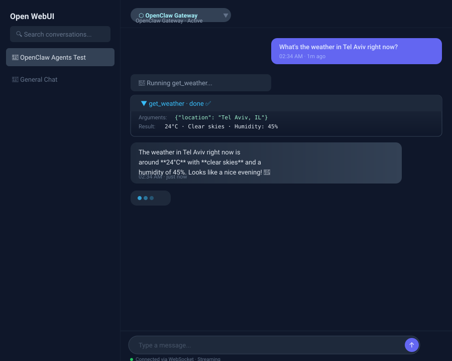

# OpenClaw ↔ Open WebUI Integration 🔌

Bidirectional integration between [OpenClaw Gateway](https://github.com/openclaw/openclaw)
and [Open WebUI](https://openwebui.com/). The primary component is a **Pipe** function
that connects via OpenClaw's native WebSocket protocol — giving you real-time
streaming, native tool-call rendering, and persistent agent sessions inside OWUI's chat
interface. A companion **Action** function adds a live session/usage lookup button
to the message toolbar.

> No separate proxy, no Node.js middleware, no Python subprocess — the whole
> integration is two self-contained Python files loaded as Open WebUI functions.

<p align="center">
  
</p>

<p align="center"><sub>Illustration of the pipe's rendering in Open WebUI.</sub></p>

> **You need a running OpenClaw Gateway before any of this is useful.**
> [OpenClaw](https://github.com/openclaw/openclaw) is a self-hosted agent
> runtime: it runs tool-using agents on your own machine and exposes them over a
> WebSocket gateway. This repo only bridges an **existing** Gateway into Open
> WebUI's chat UI — it is not itself an agent. If you don't have a Gateway yet,
> set that up first.

---

## ⚡ Quickstart

```bash
git clone https://github.com/Eliav2/openclaw-openwebui-integration
cd openclaw-openwebui-integration
uv run install.py install --wizard    # prompts for everything it needs
```

Then approve the device once on your Gateway host:

```bash
openclaw devices list
openclaw devices approve <request-id>
```

Now pick **`OpenClaw · Default`** in Open WebUI's model dropdown and say hello.
Full detail in [Installation](#-installation-automated); if something goes
wrong, jump to [Troubleshooting](#-troubleshooting).

---

## ✨ Features

- **🔴 Real-time streaming** — assistant responses appear token-by-token, not
  all at once at the end
- **🛠️ Native tool-call rendering** — tool calls are yielded as Responses-API
  output items, so OWUI renders them as native two-phase tool cards (spinner
  while running, result on finish) instead of ad-hoc HTML
- **💬 Persistent sessions** — each OWUI conversation gets a stable OpenClaw
  session key (`agent:{AGENT_ID}:openwebui-{user_id}-{chat_id}`), so the agent
  remembers context across messages
- **🧭 Dynamic model selector** — the pipe discovers every model the Gateway
  knows about (`models.list`) and lists one entry per model, with an optional
  whitelist and a size cap; legacy fixed presets (ChatGPT/Opus/Sonnet/GLM) are
  kept only for backward compatibility
- **❓ Ask-user modal** — when an agent emits a line beginning with
  `OpenClaw needs input:` (or `Codex needs input:`), the pipe intercepts it and
  pops a real OWUI input / choice / confirmation dialog mid-run, instead of
  leaking the raw prompt into the chat as text
  (see [`docs/ask-user-modal.md`](./docs/ask-user-modal.md))
- **📊 Status Action button** — a companion Action function adds a toolbar
  button that fetches live session/usage data from the Gateway on demand,
  reusing the Pipe's connection when one is already open
- **🏷️ Auto-title** — generates a chat title after the first exchange on a
  separate agent lane (`title-gen`), so it never queues behind the main
  conversation
- **🔐 Ed25519 device auth** — full WebSocket handshake with challenge/response,
  with a permanent device identity that survives restarts and reinstalls
- **🖼️ Native OWUI media support** — `MEDIA:` files are uploaded to the
  Open WebUI Files API and attached to the assistant message; a plain file
  server remains as a fallback
- **⚙️ Configurable** — settings live in OWUI valves; device identity/token
  also persist in a state directory so restarts do not force re-pairing

---

## 📦 Two Functions

| File | OWUI type | Purpose |
|------|-----------|---------|
| [`openclaw_pipe.py`](./openclaw_pipe.py) | Pipe (manifold) | The chat integration — everything above |
| [`openclaw_status_action.py`](./openclaw_status_action.py) | Action | Message-toolbar button for on-demand session/usage lookups; reuses the Pipe's live connection and device identity, no second pairing |

Both are generated from the same `src/openclaw_pipe_pkg/` source fragments —
see [Development](#-development) if you're contributing.

---

## 📋 Requirements

| Component | Version |
|-----------|---------|
| Open WebUI | ≥ v0.10.2 — developed and tested against v0.10.2 and v0.11.0 |
| OpenClaw Gateway | v2025+ (WS protocol v4) |
| Python (in OWUI) | websockets, cryptography |
| | (pydantic ships with OWUI) |

> **Open WebUI version:** native tool-card rendering depends on OWUI's
> Responses-API streaming handler. The pipe performs no runtime version check,
> so on older releases tool cards degrade silently rather than erroring.

> **`websockets` / `cryptography`:** both functions declare them in the
> `requirements:` frontmatter field, so Open WebUI pip-installs them itself the
> first time the function loads. If your deployment sets
> `ENABLE_PIP_INSTALL_FRONTMATTER_REQUIREMENTS=false` or runs with
> `OFFLINE_MODE`, install the two packages into the OWUI image yourself.

---

## 🚀 Installation (automated)

### Prerequisites

- A running OpenClaw Gateway, reachable from the machine Open WebUI runs on
- Admin credentials for your Open WebUI instance
- Your OpenClaw Gateway API token — the value of `gateway.auth.token` in your
  OpenClaw config, or ask whoever runs your Gateway
- [`uv`](https://docs.astral.sh/uv/) on the **machine running the installer**
  (not inside OWUI). If you don't have it:

  ```bash
  curl -LsSf https://astral.sh/uv/install.sh | sh
  ```

  No `uv`? Plain `pip install cryptography click rich` + `python3 install.py
  install` works identically — `uv` just removes that manual step. (A bare
  `python3 install.py` with no subcommand only prints help.)

### Run the installer

**First time, no env vars handy?** Run the interactive wizard — it prompts for
everything it needs and explains where to find each value:

```bash
uv run install.py install --wizard
```

**Scripted / repeat installs** — set env vars once, then run non-interactively
(handy for CI, config management, or reinstalling after an OWUI upgrade):

```bash
export OWUI_URL=http://your-owui-host:8080
export OWUI_EMAIL=admin@example.com
export OWUI_PASSWORD=your-password
export GATEWAY_URL=your-gateway-host:18789
export GATEWAY_TOKEN=your-gateway-token
export AGENT_ID=main
export OWUI_API_BASE_URL=http://your-owui-host:8080

# Optional
export OPENCLAW_BRIDGE_STATE_DIR=/data/openclaw-bridge  # note the prefix — not STATE_DIR
export OWUI_API_KEY=...                                 # only if the request bearer token can't be used for uploads
export FILE_SERVER_BASE_URL=http://your-owui-host:18791 # only if you rely on the legacy media fallback

# Install or update the pipe in place, then run a smoke test
uv run install.py install

# Repair a broken install without deleting the function or valves
uv run install.py repair

# Inspect current state without changing anything
uv run install.py status

# Run status checks plus an end-to-end smoke test
uv run install.py healthcheck
```

`uv run install.py` resolves `cryptography`, `click`, and `rich` into an
ephemeral environment automatically — no venv or `pip install` step needed.
You can also run it straight from GitHub without cloning first:

```bash
uv run https://raw.githubusercontent.com/Eliav2/openclaw-openwebui-integration/main/install.py install --wizard
```

In that no-clone form there is no `openclaw_pipe.py` next to the script, so the
installer downloads the artifact from this repo before deploying it. Set
`OPENCLAW_PIPE_ARTIFACT_URL` to point that at a fork, a pinned tag, or an
internal mirror.

The script will:
1. Log in to Open WebUI
2. Check if the pipe function already exists
3. **If exists:** update the code in-place (preserving all valves including `DEVICE_IDENTITY`)
4. **If new:** create the pipe function
5. Back up the existing function and valves to `backups/`
6. Ensure it is active + global without blindly toggling it off
7. Generate or reuse a **permanent device identity** (Ed25519 key pair)
8. Restore valves if Open WebUI drops them during a function update
9. Run an end-to-end smoke test through `/api/chat/completions`
10. If a matching pairing request is pending, approve it automatically when the
    local `openclaw` CLI is available

> **v2+ no longer deletes and recreates the function**, which means your
> valve settings (especially `DEVICE_IDENTITY`) survive re-installation.
> The old `delete+create` cycle that wiped `DEVICE_IDENTITY` and forced
> re-approval is gone.

### Verify it worked

1. `uv run install.py healthcheck` — status checks plus an end-to-end smoke
   test. It should finish with all ✓ and exit 0.
2. Reload Open WebUI. `OpenClaw · Default` should appear in the model picker.
3. Select it and send "hello". Text should stream in token by token.

If the smoke test reports **pairing required**, that's expected on a first
install — approve the device (below), then re-run it.

### Uninstalling

There's no `uninstall` subcommand; removal is a UI action. In Open WebUI go to
**Admin Panel → Functions** and delete `openclaw_gateway` (and
`openclaw_status_action` if you installed it). Every install first writes the
previous function and its valves to `backups/`, so if you only want to roll back
a bad upgrade, restore the JSON from there rather than deleting.

Deleting the functions does not touch `STATE_DIR`. Remove that directory too if
you want the device identity gone, and revoke the device on the Gateway with
`openclaw devices list` / `openclaw devices remove <id>`.

### Installing the companion Status Action

`install.py` manages `openclaw_pipe.py`. The Status Action has its own
installer — install the Pipe first, since it is the source of truth for the
shared valves:

```bash
uv run install_action.py install   # create/update the Action, mirror valves from the Pipe, smoke test
uv run install_action.py status    # inspect without changing anything
uv run install_action.py repair    # same as install
```

It reads only `OWUI_URL`, `OWUI_EMAIL`, and `OWUI_PASSWORD`. The five shared
valves — `GATEWAY_URL`, `GATEWAY_TOKEN`, `DEVICE_IDENTITY`, `STATE_DIR`,
`AGENT_ID` — are copied verbatim from the Pipe's valves, so the Action reuses
the Pipe's already-approved device identity and never triggers a second pairing.
It fails fast if the Pipe isn't installed yet.

Two differences from `install.py`: it must be run from a clone (it imports from
`install.py`, so the `uv run <raw-github-url>` form doesn't work), and it has no
`healthcheck` subcommand.

### Restart-safe state

The pipe loads identity in this order:

1. `STATE_DIR/identity.json` (default: `/data/openclaw-bridge/identity.json`)
2. `DEVICE_IDENTITY` valve, then persists it into `STATE_DIR`
3. Generate a new identity only if neither exists

The Gateway device token is saved to `STATE_DIR/device-token.json` after a
successful connection. This keeps OWUI restarts and pipe reloads from creating
new devices or requiring repeated approvals.

> **If `STATE_DIR` isn't writable**, the pipe falls back to
> `/tmp/openclaw-bridge` and logs `STATE_DIR unavailable`. `/tmp` usually does
> not survive a container restart, so identity and device token are lost and
> you get a fresh pairing prompt every time. If OWUI keeps asking you to
> re-approve the device, grep the backend log for `STATE_DIR unavailable` and
> point `STATE_DIR` at a real persistent volume. `/data` is not mounted in
> every OWUI deployment.

### OWUI model selector

The pipe is a manifold function: `pipes()` calls the Gateway's `models.list`
RPC (falling back to a cached list, then a small hardcoded list, if the
Gateway is unreachable) and returns one selector entry per discovered model,
plus an always-present `OpenClaw · Default` entry. Selecting a model patches
that OWUI conversation's OpenClaw session to that model; switching back to
`Default` clears the override and returns to the agent's configured default.

Relevant valves:

| Valve | Description |
|-------|-------------|
| `CONFIGURED_MODELS` | Comma-separated whitelist of model keys to show. Empty = show all discovered models. |
| `DEFAULT_MODEL` | Model used when `OpenClaw · Default` is selected. Also doubles as a reference dropdown of known model keys. |
| `MAX_MODELS` | Safety cap on how many models the selector lists when there's no whitelist (default `30`). |

**Legacy fixed presets** (`ChatGPT · GPT-5.5`, `Claude · Opus 4.8`,
`Claude · Sonnet 5`, `GLM 5.2`) still work via the `CHATGPT_MODEL`,
`OPUS_MODEL`, `SONNET_MODEL`, and `GLM_MODEL` valves, kept only for backward
compatibility with conversations that already picked one of them. New
installs should rely on dynamic discovery instead of these valves.

### Auto-generated chat titles

When `AUTO_TITLE` is enabled (default), the pipe generates a chat title after
the first exchange, similar to native OWUI behavior. Title generation runs on
a separate agent lane (`TITLE_GEN_AGENT_ID`, default `title-gen`) so it never
queues behind — or pollutes — the main conversation's session.

### Native OWUI media delivery

When the agent emits a `MEDIA:<filename>` directive and the file exists in the
pipe media directory, the pipe now tries this path first:

1. Upload the file to `POST /api/v1/files/?process=false`
2. Emit a `files` event so Open WebUI attaches the file to the assistant message
3. Yield same-origin markdown such as
   ``

This avoids mixed-content blocking when OWUI is opened over HTTPS. If upload
auth is unavailable or the Files API fails, the pipe falls back to the legacy
`FILE_SERVER_BASE_URL` behavior.

Relevant valves:

| Valve | Description |
|-------|-------------|
| `USE_OWUI_FILES` | Enable OWUI Files API upload for `MEDIA:` directives (default: `True`) |
| `OWUI_BASE_URL` | Base URL the pipe uses to call the OWUI Files API (default: `http://127.0.0.1:8080`). The pipe runs inside the OWUI backend, so the loopback default is usually correct. |
| `OWUI_API_KEY` | Optional API key for uploads; the current request bearer token is preferred (default: empty) |
| `FILE_SERVER_BASE_URL` | Legacy fallback base URL for the built-in media file server, used only when `USE_OWUI_FILES` is off or an upload fails (default: `http://localhost:18791`). The **browser** resolves this URL, not OWUI, so the default only works when you browse OWUI from the same host. |
| `SEND_STOP_ON_CANCEL` | Send `/stop` after `chat.abort` when OWUI cancels a stream (default: `True`) |

### Approve the device in the Gateway

When using the pipe for the first time, your OpenClaw Gateway will prompt
for device approval. On the Gateway host, run:

```bash
openclaw devices list      # find the pending request
openclaw devices approve <request-id>
```

**The identity is permanent.** The installer prefers the existing
`DEVICE_IDENTITY` valve, mirrors it into `./.pipe_device_identity.json`, and the
pipe persists it inside `STATE_DIR` on first run. Valve updates are in-place, so
approval lasts across reinstalls and restarts.

### Manual installation (alternative)

If you can't run the script, install manually:

1. Open **Admin Panel** → **Functions** in OWUI
2. Click **"+"** → **"Create a function"** with ID `openclaw_gateway`, type `pipe`
3. Paste the contents of [`openclaw_pipe.py`](./openclaw_pipe.py)
4. Save, then toggle **Active** → **ON** and **Global** → **ON**
5. Set the valves:

   | Valve | Description |
   |-------|-------------|
   | `GATEWAY_URL` | OpenClaw Gateway address, `host:port`, no scheme (default: `localhost:18789`) |
   | `GATEWAY_TOKEN` | Your gateway API token |
   | `AGENT_ID` | Which agent to route to (default: `main`) |
   | `DEVICE_IDENTITY` | Paste from `./.pipe_device_identity.json` after running the script once, or leave empty |
   | `ENABLE_FILE_SERVER` | `True` (media support) |
   | `USE_OWUI_FILES` | `True` (native OWUI Files API media support) |
   | `OWUI_BASE_URL` | Open WebUI base URL reachable from the OWUI backend |
   | `SEND_STOP_ON_CANCEL` | `True` (workaround for `chat.abort` not stopping active tool subprocesses) |

6. Choose `OpenClaw · Default` (or any discovered model) and start chatting

Optionally repeat the same steps for the Status Action, creating an
**Action** function (not a Pipe) with id `openclaw_status_action` and the
contents of [`openclaw_status_action.py`](./openclaw_status_action.py). Turn on
**Global** so the button appears on every model's messages, then set all five of
its valves — `GATEWAY_URL`, `GATEWAY_TOKEN`, `DEVICE_IDENTITY`, `STATE_DIR`,
`AGENT_ID` — to exactly the same values as the Pipe's.

> Do not skip `DEVICE_IDENTITY` here. Without it, a fallback connection from the
> Action registers as a *new* device and the Gateway raises a second pairing
> request. `uv run install_action.py install` mirrors all five for you.

---

## 📋 Metadata Contract

Every user message that reaches the agent through the pipe includes two
(untrusted) metadata blocks. Agents **should** read these to understand the
conversation context.

### Sender (untrusted metadata)

```json
{
  "label": "webchat",
  "id": "webchat"
}
```

- Always `"webchat"` — the Gateway client label for the pipe WebSocket
  connection. This is a fixed value; the Gateway client-id registry does not
  accept custom labels for operator clients.
- Marked "untrusted" because values are not verified by the Gateway.
- Tells the agent the message came through the OWUI pipe, not another surface.

### Conversation info (untrusted metadata)

```json
{
  "chat_id": "11111111-2222-4333-8444-555555555555",
  "source": "openwebui",
  "user_id": "66666666-7777-4888-8999-000000000000"
}
```

| Field | Type | Always present | Description |
|-------|------|----------------|-------------|
| `chat_id` | string (UUID v4) | ✅ | The OWUI conversation UUID. Stable for the lifetime of the chat. |
| `source` | string | ✅ | Always `"openwebui"`. **Use this, not Sender, to detect OWUI origin.** |
| `user_id` | string (UUID v4) | ⚠️ | The OWUI user UUID. **Omitted** when OWUI supplies no user id — the pipe's internal fallback is the literal `unknown`, which is never emitted. Treat as optional. |

> The whole **Conversation info** block is emitted only when a `chat_id` is
> available. Agents should handle its absence rather than assume it.

### Usage patterns

- **Detect OWUI:** check `Conversation info.source == "openwebui"` (not Sender)
- **Get chat UUID:** extract `chat_id` for OWUI REST API calls (read history,
  check files)
- **Session key:** the pipe derives
  `agent:{AGENT_ID}:openwebui-{user_id}-{chat_id}` (`AGENT_ID` is `main` by
  default; a non-default agent changes the key),
  matching the `chat_id` here
- **Distinguish surfaces:** OWUI has Conversation info; Discord has
  `Sessions` prefix; Control UI has neither

### Stability guarantee

The field types, names, and presence guarantees in this contract are stable
across pipe versions unless a major version bump indicates otherwise. Changes
will be documented here.

---

## 🧠 How It Works

```
┌──────────────────────┐       WS (v4)        ┌──────────────────┐
│   Open Web UI        │ ◄──────────────────► │  OpenClaw        │
│                      │   stream=assistant   │  Gateway         │
│  ┌────────────────┐  │   stream=tool        │                  │
│  │ openclaw_pipe  │──┤   stream=item        │  ┌────────────┐  │
│  │ (OWUI Pipe)    │  │   stream=lifecycle   │  │ Agent(s)   │  │
│  └────────────────┘  │                      │  └────────────┘  │
│                      │                      │                  │
│  OWUI renders:       │                      └──────────────────┘
│   • Text streaming   │
│   • Native tool cards│
│   • Status updates   │
│   • Media links      │
└──────────────────────┘
```

The pipe:
1. Receives the user's message from OWUI
2. Opens (or reuses) a persistent, singleton WebSocket connection to the
   Gateway, shared across all conversations
3. Performs the Ed25519 challenge/response handshake once, on first use
4. Sends the message with a stable session key
5. **Yields** each event chunk back to OWUI:
   - `stream="assistant"` → text delta → **yielded** for streaming
   - `stream="tool"` → tool call → **yielded** as a native Responses-API
     output item, so OWUI renders a two-phase tool card (spinner while
     running, result on finish) instead of hand-built HTML
   - `stream="lifecycle"` → end signal → **done**

Because the pipe is an **async generator** (uses `yield` instead of `return`),
OWUI streams each chunk to the frontend in real time. Once content is yielded
it's frozen on screen for the rest of the run — the pipe can still update
what's saved to the OWUI database afterward, but not what's already rendered
— so anything meant to change later (like a tool result replacing a spinner)
has to be sent as a fresh item, not a patch to an old one.

---

## 🔧 Troubleshooting

| Symptom | Likely cause |
|---------|-------------|
| Text appears all at once | Pipe uses `return` instead of `yield` (check your code) |
| "No GATEWAY_TOKEN configured" | Valve not set — go to Admin → Functions → edit valves |
| An `**Error:**` line instead of a reply | OWUI can't reach `GATEWAY_URL` — check network connectivity from the OWUI backend |
| Model missing from selector | Run `uv run install.py repair`; it ensures the function is active/global and visible in `/api/v1/models`. Also check `CONFIGURED_MODELS` isn't filtering it out. |
| "pairing required" | Run `uv run install.py repair` or approve the matching request with `openclaw devices approve <request-id>` |
| Image still uses the legacy file server | OWUI file upload failed and the pipe fell back; check `OWUI_BASE_URL`, request auth/API key, and OWUI logs |
| Tool calls not showing | The `__event_emitter__` calls fail silently; check OWUI backend logs |
| Device identity not persisting | Check `STATE_DIR` and the `DEVICE_IDENTITY` valve; run `uv run install.py healthcheck` |
| Stream stops mid-response | The pipe probes the Gateway after 30s of silence and gives up after 180s with no text; check agent response time and the OWUI backend log |
| Repeated device-pairing prompts | `STATE_DIR` isn't persistent — grep the OWUI backend log for `STATE_DIR unavailable` |
| `ModuleNotFoundError: websockets` on load | OWUI's frontmatter auto-install is off (`ENABLE_PIP_INSTALL_FRONTMATTER_REQUIREMENTS=false`) or it's in offline mode — install `websockets` and `cryptography` into the OWUI image |
| Restarting mid-turn loses context | Known OpenClaw limitation — avoid restarting the Gateway while a run is in flight |

Check OWUI's backend logs for `[openclaw-pipe]` prefixed messages.

---

## 📁 File Layout

```
openclaw-openwebui-integration/
├── openclaw_pipe.py           # Built artifact — paste this into OWUI (Pipe)
├── openclaw_status_action.py  # Built artifact — paste this into OWUI (Action)
├── src/
│   ├── frontmatter.txt         # Pipe docstring + OWUI metadata (title/version/requirements)
│   ├── frontmatter-action.txt  # Same, for the Action
│   └── openclaw_pipe_pkg/     # Source of truth — edit these, not the artifacts above
│       ├── _prelude.py         # Imports shared by every fragment, plus pipe_log()
│       ├── pipe.py              # Pipe class: valves and the pipe() entry point
│       ├── gateway.py            # WebSocket connection, handshake, event dispatch/demux
│       ├── action.py              # Status Action class
│       ├── askuser.py              # "needs input:" interception + modal plumbing
│       ├── emit.py                  # Event emission / tool-card formatting helpers
│       ├── media.py                  # MEDIA: directive handling, OWUI Files API upload
│       ├── models.py                  # Dynamic model discovery, whitelist, fallback list
│       ├── identity.py                 # Ed25519 device identity load/generate/persist
│       ├── state.py                     # STATE_DIR read/write helpers
│       └── __init__.py
├── build.py                    # Concatenates src/ fragments into the artifacts above
├── install.py                  # Automated installer/updater/healthcheck script
├── install_action.py           # Same, for the Status Action
├── test_*.py                   # Unit + integration test suites (see Development)
├── scripts/                    # Auxiliary scripts (OWUI API client, live verifiers)
├── docs/                       # Design + behavior docs (see Development)
├── .github/workflows/ci.yml    # Drift guard + tests + artifact load check
├── backups/                    # Local install backups (gitignored, created on first install)
├── owui-screenshot.svg         # README screenshot
├── README.md                   # This file
├── LICENSE                     # MIT
├── .gitattributes
└── .gitignore
```

> `src/frontmatter.txt` is load-bearing: Open WebUI reads the function's title,
> version, and `requirements:` from the leading docstring, and `build.py` emits
> it as the first bytes of the artifact. Valve *documentation* shown in OWUI
> lives there; valve *definitions* live in `pipe.py`.

> `.pipe_device_identity.json` is created by `install.py` to persist the
> device identity across re-installs. It contains a private key — **do not**
> commit or share it.

---

## 🧑‍💻 Development

`openclaw_pipe.py` and `openclaw_status_action.py` are **built artifacts** —
don't hand-edit them. Edit the fragments under `src/openclaw_pipe_pkg/`, then
rebuild:

```bash
python3 build.py --all        # rebuild BOTH artifacts (DEV-ONLY blocks stripped)
python3 build.py --check-all  # verify both committed artifacts match src/ (CI drift guard)

python3 build.py              # rebuild openclaw_pipe.py only
python3 build.py --action     # rebuild openclaw_status_action.py only
python3 build.py --check      # drift guard, Pipe only
python3 build.py --check-action  # drift guard, Action only
```

Each single-artifact invocation builds exactly one file, and several fragments
feed **both** artifacts — so prefer `--all` / `--check-all`. Using the
Pipe-only `--check` after editing `action.py` reports "no drift" while the
committed Action artifact is stale.

Why a hand-written concatenation instead of a bundler: OWUI reads a function
as a single flat `.py` file, using the frontmatter docstring for metadata and
introspecting a top-level `Pipe`/`Action` class directly — most bundlers
break one or both of those.

### Docs

| Doc | What it covers |
|-----|----------------|
| [`docs/rehydration-persistence.md`](./docs/rehydration-persistence.md) | How Open WebUI persists an assistant message, why `output` wins over `content`, and why the pipe emits mid-run snapshots so a client reconnecting mid-turn isn't left staring at an empty message. Read this before changing anything about snapshots or streaming. |
| [`docs/ask-user-modal.md`](./docs/ask-user-modal.md) | Design spec for a tool-call-based ask-user flow. **Not implemented as written** — see the banner at the top; the shipped approach intercepts `OpenClaw needs input:` text. |

`scripts/verify_rehydration.py` is a live verifier for the behavior described in
the first doc. It needs the pipe deployed and a real streaming turn — it polls a
chat until the turn is done and reports whether mid-run snapshots landed and
whether the final message duplicated itself.

### Running the tests

```bash
uv run --with pytest --with pydantic --with websockets --with cryptography \
  --with click --with rich pytest -q
```

This is green on a fresh clone with no setup.

Most of the suite (`test_pipe_unit.py`, `test_status_action_unit.py`,
`test_build.py`, `test_devcoord_unit.py`, `test_install_unit.py`) is pure unit
tests with no external dependencies. `test_fixture_owui_streaming_handler.py`
is not a suite — it's a verbatim copy of Open WebUI's streaming handler, used
as a fixture to pin tool-card rendering against the real thing.

`test_pipe.py` and `scripts/test_auto_title.py` are **integration tests**
against a live OWUI. They **skip** unless `OWUI_EMAIL` and `OWUI_PASSWORD` are
set, and skip with a diagnostic if login fails or the pipe isn't registered. To
actually run them:

```bash
export OWUI_URL=http://your-owui-host:8080
export OWUI_EMAIL=admin@example.com
export OWUI_PASSWORD=your-password
uv run --with pytest --with pydantic --with websockets --with cryptography \
  --with click --with rich pytest -q test_pipe.py
```

CI (`.github/workflows/ci.yml`) runs the drift guard for both artifacts, the
unit suite, and a load check that execs each artifact the way OWUI's plugin
loader does, on Python 3.10–3.12.

---

## 🧪 Testing the pipe via API

You can send messages through the pipe as if using the OWUI frontend by calling
the internal `/api/chat/completions` endpoint:

```bash
# 1. Sign in to get a token
TOKEN=$(curl -s -X POST http://localhost:8080/api/v1/auths/signin \
  -H "Content-Type: application/json" \
  -d '{"email":"admin@example.com","password":"***"}' \
  | python3 -c "import sys,json;print(json.load(sys.stdin)['token'])")

# 2. Send a message through the pipe
curl -s -X POST http://localhost:8080/api/chat/completions \
  -H "Authorization: Bearer $TOKEN" \
  -H "Content-Type: application/json" \
  -d '{
    "model": "openclaw_gateway.default",
    "messages": [{"role": "user", "content": "Hello!"}],
    "stream": false
  }'
```

This triggers the full pipeline — pipe function → Gateway → agent → response —
and the conversation is saved to OWUI chat history automatically.

---

## 🔒 Security notes

- **`GATEWAY_TOKEN` and `DEVICE_IDENTITY` are secrets.** `DEVICE_IDENTITY` holds
  an Ed25519 **private key**. `install.py` mirrors it to
  `./.pipe_device_identity.json` (gitignored) and backs valves up to `backups/`
  (also gitignored) — don't commit or share either.
- **The legacy media file server is unauthenticated.** When
  `ENABLE_FILE_SERVER` is on (the default), the pipe serves
  `/tmp/openclaw-pipe-media` over HTTP on port **18791**, bound to `0.0.0.0`
  with `Access-Control-Allow-Origin: *` and no auth. Anyone who can reach that
  port can read files the agent has emitted. It exists only as a fallback for
  the OWUI Files API path (`USE_OWUI_FILES`, on by default and same-origin).
  Keep 18791 off untrusted networks, or set `ENABLE_FILE_SERVER=False` if you
  don't need the fallback.
- **The pipe runs inside the OWUI backend** and talks to the Gateway with the
  configured agent's privileges. Anyone who can chat with the pipe can drive
  that agent — scope `AGENT_ID` accordingly.

---

## 📜 License

MIT — see [LICENSE](./LICENSE).

---

## 🙏 Acknowledgements

- Based on [cfullelove's gist](https://gist.github.com/cfullelove/7c6fa74e16d0a8f355e6d5ddb6d8e5fb)
  — the original proof-of-concept that got this rolling
- [Open WebUI](https://openwebui.com/) for the excellent pipe/function system
- [OpenClaw](https://github.com/openclaw/openclaw) for the WS Gateway Protocol
