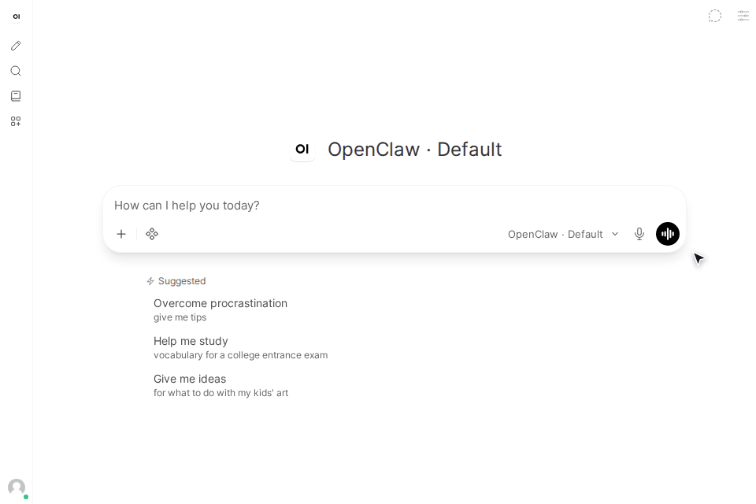
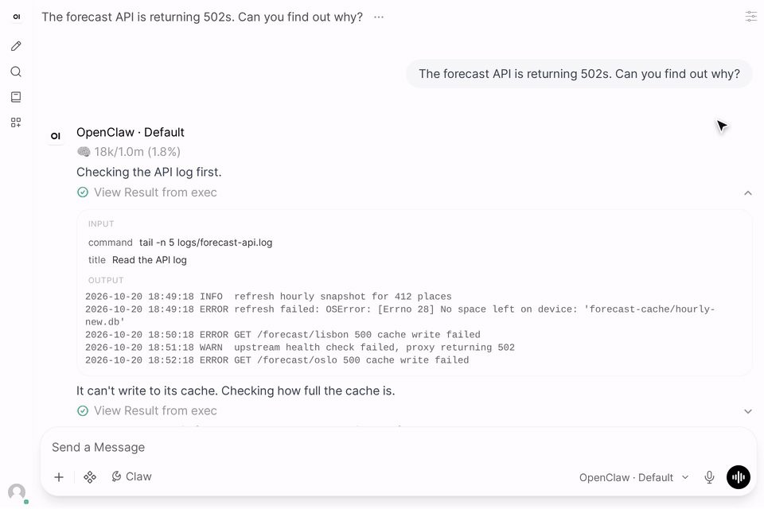
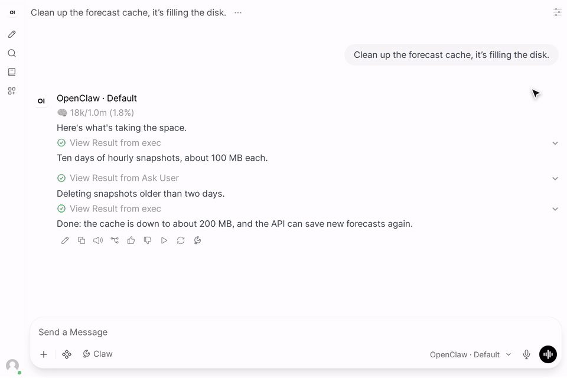
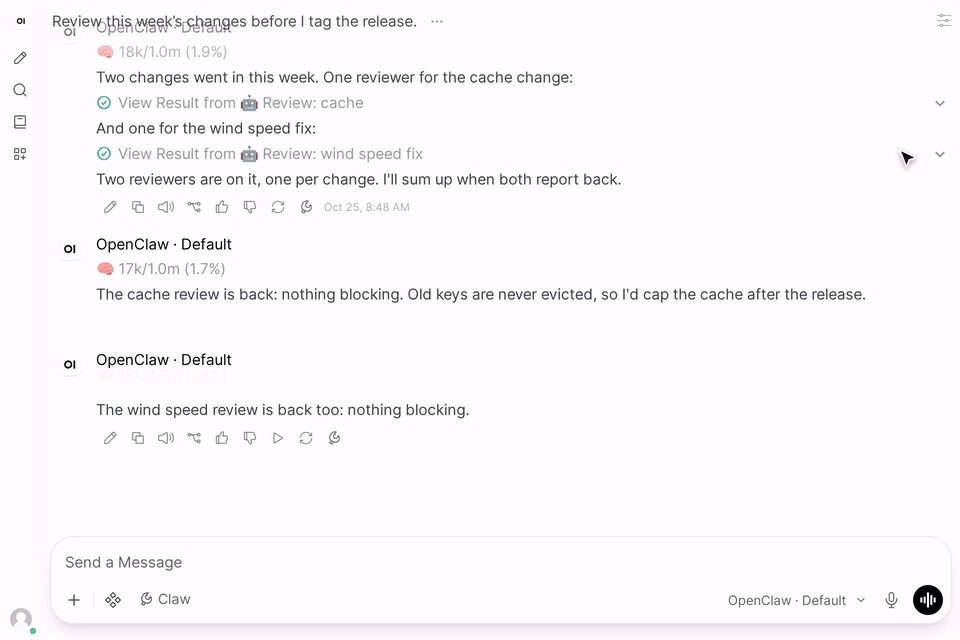
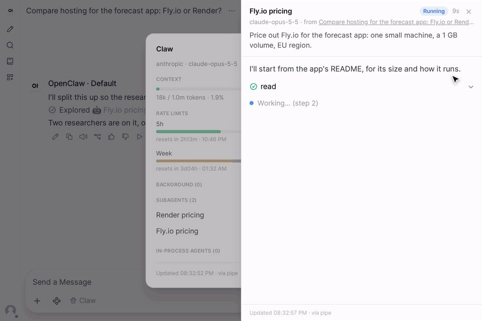

# OpenClaw for Open WebUI

[](https://github.com/Eliav2/openclaw-openwebui-integration/actions/workflows/ci.yml)
[](https://eliav2.github.io/openclaw-openwebui-integration/)
[](./LICENSE)

<p align="center">
  
</p>

Chat with your [OpenClaw](https://github.com/openclaw/openclaw) agents from Open WebUI and watch them work: tool calls as cards, questions as dialogs, sub-agents in a live panel.
It connects to your running Gateway over its native protocol; it is not an agent itself.

## Install in 30 seconds

On any machine that can reach Open WebUI (needs [uv](https://docs.astral.sh/uv/)):

```bash
git clone https://github.com/Eliav2/openclaw-openwebui-integration
cd openclaw-openwebui-integration
uv run install.py install --wizard
```

Then approve the device on the Gateway host (`openclaw devices approve <request-id>`; the installer does it for you if it ran there), pick **OpenClaw · Default** in Open WebUI and say hello. The [Quick start](https://eliav2.github.io/openclaw-openwebui-integration/install/quickstart) has a check at each step.

## Features

<table>
<tr>
<td width="50%" valign="middle">

### Live tool cards

Each command the agent runs is a card that fills in as it runs. Open one to see the exact command and its output.

[Docs →](https://eliav2.github.io/openclaw-openwebui-integration/features/chat#tool-cards)

</td>
<td width="50%">
<a href="https://eliav2.github.io/openclaw-openwebui-integration/features/chat#tool-cards"><picture><source srcset="./docs/img/demos/tile-tool-cards.gif" type="image/gif"></picture></a>
</td>
</tr>
<tr>
<td width="50%" valign="middle">

### Questions as cards

When the agent needs a decision, it asks with a card of choices, and the run goes on as soon as you pick one.

[Docs →](https://eliav2.github.io/openclaw-openwebui-integration/features/questions)

</td>
<td width="50%">
<a href="https://eliav2.github.io/openclaw-openwebui-integration/features/questions"><picture><source srcset="./docs/img/demos/tile-question.gif" type="image/gif"></picture></a>
</td>
</tr>
<tr>
<td width="50%" valign="middle">

### Sub-agents you can watch

Each sub-agent gets its own card with its task, and its result comes back to the chat by itself.

[Docs →](https://eliav2.github.io/openclaw-openwebui-integration/features/chat#sub-agent-cards)

</td>
<td width="50%">
<a href="https://eliav2.github.io/openclaw-openwebui-integration/features/chat#sub-agent-cards"><picture><source srcset="./docs/img/demos/tile-sub-agents.gif" type="image/gif"></picture></a>
</td>
</tr>
<tr>
<td width="50%" valign="middle">

### The Status dialog

With the Status Action installed, one click shows context used, rate limits and every sub-agent with its progress.

[Docs →](https://eliav2.github.io/openclaw-openwebui-integration/features/status#the-status-dialog)

</td>
<td width="50%">
<a href="https://eliav2.github.io/openclaw-openwebui-integration/features/status#the-status-dialog"><picture><source srcset="./docs/img/demos/status-dialog.gif" type="image/gif"></picture></a>
</td>
</tr>
</table>

**Also in the box:**

- **[Talk to it while it works](https://eliav2.github.io/openclaw-openwebui-integration/features/reliability#messages-sent-while-the-agent-works):** a message sent mid-run does not cut the run off, and gets its own answer.
- **[Survives reloads and restarts](https://eliav2.github.io/openclaw-openwebui-integration/features/reliability#gateway-restarts):** reload the page or restart Open WebUI or the Gateway, and the reply finishes in the same message.
- **[Replies the agent starts](https://eliav2.github.io/openclaw-openwebui-integration/features/agent-turns):** cron jobs, heartbeats and sub-agent results reply in the chat, live.
- **[Every Gateway model](https://eliav2.github.io/openclaw-openwebui-integration/features/sessions-and-models#model-picker):** the model picker lists the models your Gateway allows, one session per chat.

## Docs

Everything else is on the docs site: **[eliav2.github.io/openclaw-openwebui-integration](https://eliav2.github.io/openclaw-openwebui-integration/)**, from [why this exists](https://eliav2.github.io/openclaw-openwebui-integration/why) to [configuration](https://eliav2.github.io/openclaw-openwebui-integration/configuration), [troubleshooting](https://eliav2.github.io/openclaw-openwebui-integration/troubleshooting) and [versions](https://eliav2.github.io/openclaw-openwebui-integration/versions). For agents: [llms.txt](https://eliav2.github.io/openclaw-openwebui-integration/llms.txt) and [llms-full.txt](https://eliav2.github.io/openclaw-openwebui-integration/llms-full.txt). The same pages are in [docs/](./docs/index.md) here.

## Security, license, thanks

- **Security:** the integration drives your agent with its full privileges, so anyone who can chat with it can too. Read [Security](https://eliav2.github.io/openclaw-openwebui-integration/security) before you open Open WebUI to others, and report issues as [SECURITY.md](./SECURITY.md) describes.
- **License:** MIT, see [LICENSE](./LICENSE).
- **Thanks** to [cfullelove's gist](https://gist.github.com/cfullelove/7c6fa74e16d0a8f355e6d5ddb6d8e5fb), the proof of concept this grew from, and to [Open WebUI](https://openwebui.com/) and [OpenClaw](https://github.com/openclaw/openclaw).
